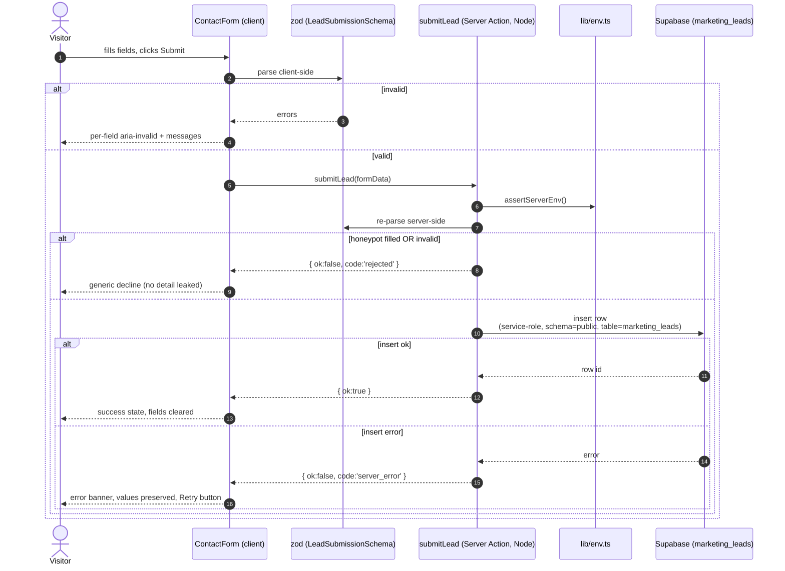
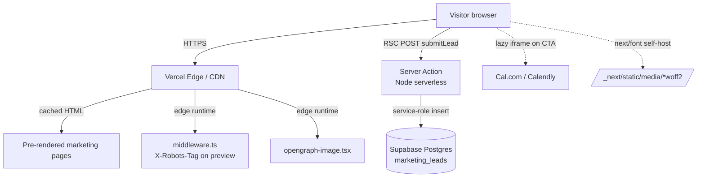
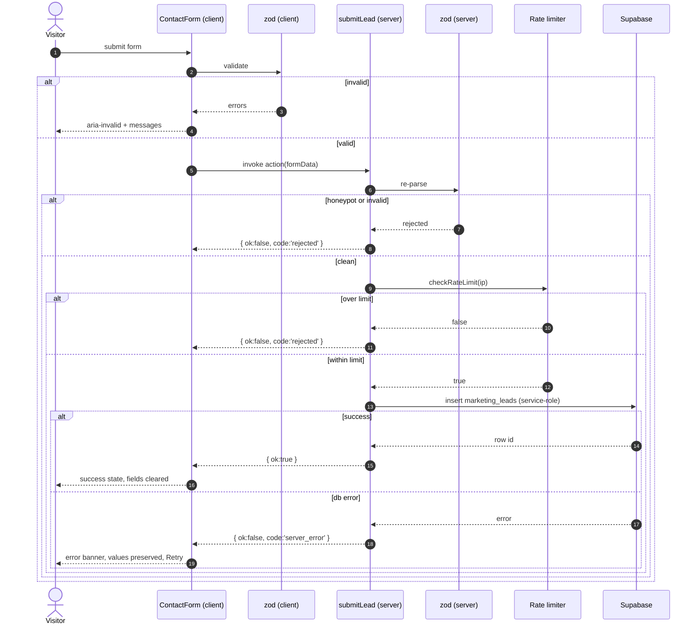

# Design Document

## Overview

The Marketing Landing Site is a standalone Next.js 14+ App Router application housed at `marketing_site/` in the monorepo. It is decoupled from the Flutter app and the existing `web_portal/`, ships its own `package.json`, and deploys to Vercel as an independent project. Marketing pages (`/`, `/features`, `/pricing`, `/about`, `/blog`, `/blog/[slug]`) are statically generated; the contact lead path is the only stateful interaction and is implemented as a Server Action that talks to Supabase using a server-only service-role key. The demo booking flow is a third-party calendar (Cal.com recommended) embedded in a lazy-loaded modal driven by a single environment variable.

The design favors zero-runtime-dependency content authoring (MDX compiled at build time), a Tailwind-based brand system with CSS variables for theming, and `next-themes` for system-aware theme persistence with a no-flash inline script. There are no client-side state stores, no analytics SDKs by default, and no calendar SDKs in the initial bundle.

## Architecture

### High-Level Architecture

```mermaid
flowchart LR
    subgraph Visitor["Executive Admin Visitor"]
        B[Browser]
    end

    subgraph Vercel["Vercel Edge / Serverless"]
        EN[Edge Network / CDN]
        SSG[Static Pages: /, /features, /pricing, /about, /blog, /blog/[slug]]
        SA[Server Action: submitLead]
        OG[opengraph-image.tsx via @vercel/og]
        SM[sitemap.ts / robots.ts]
        MW[middleware.ts<br/>noindex on preview]
    end

    subgraph Third["Third-Party"]
        SB[(Supabase Postgres<br/>marketing_leads)]
        CAL[Cal.com / Calendly<br/>iframe embed]
        FNT[Google Fonts<br/>Outfit + Plus Jakarta Sans]
    end

    B -->|HTTP| EN
    EN --> SSG
    EN --> OG
    EN --> SM
    EN --> MW
    B -.lazy iframe.-> CAL
    B -.next/font self-host.-> FNT
    SSG -->|hydrate| B
    B -->|POST RSC action| SA
    SA -->|service-role insert| SB
```

### Rendering Strategy

| Route | Mode | Reason |
|---|---|---|
| `/` | SSG | Pure marketing content, no per-request data |
| `/features` | SSG | Static role descriptions |
| `/pricing` | SSG | Static tier definitions in code |
| `/about` | SSG | Static narrative |
| `/contact` | SSG (form is client component) | Static shell; submission via Server Action |
| `/blog` | SSG (revalidate: 3600) | MDX file globs at build, ISR for content edits without redeploy |
| `/blog/[slug]` | SSG via `generateStaticParams` (revalidate: 3600) | One static route per published post |
| `/sitemap.xml`, `/robots.txt` | Static at build | Generated from route registry + post manifest |
| `/opengraph-image` | Edge runtime, cached | `@vercel/og` per-route default image |
| Server Action `submitLead` | Node serverless | Needs `SUPABASE_SERVICE_ROLE_KEY` (server-only) |
| `middleware.ts` | Edge | Adds `X-Robots-Tag: noindex` on preview deployments |

ISR is set to `export const revalidate = 3600` on blog routes so that content edits picked up via redeploy or on-demand revalidation become visible without a cold deploy. All other marketing pages are pure static.

### MDX Choice: `@next/mdx`

I picked `@next/mdx` (with `remark-gfm` and `rehype-pretty-code` via shiki) over `contentlayer-lite` and `mdx-bundler` for these reasons:

- It is the smallest dependency footprint (no extra build pipeline, no runtime worker). Contentlayer is unmaintained on Next 14+; `mdx-bundler` adds esbuild as a build-time dep we don't need.
- App Router has first-class `@next/mdx` support; `.mdx` files in `content/blog/` are imported through a thin loader that exposes typed frontmatter.
- Frontmatter is extracted with `gray-matter`; reading time computed via `reading-time`. Both are tiny.

The trade-off is that we hand-write a small `lib/mdx.ts` to glob the `content/blog` folder and produce a typed manifest. Acceptable, since blog volume is small.

### Component Architecture

Every marketing page is composed from `<section>` blocks defined in `components/sections/`, with shared primitives in `components/ui/`. Pages are server components by default. Only the following are client components:

- `ContactForm` (form state, validation, optimistic UI)
- `DemoBookingTrigger` + `DemoModal` (modal state, focus trap, iframe load timer)
- `ThemeToggle`, `ThemeProvider` wrapper
- `MobileMenu` (open/close, focus trap)

This keeps the JS budget on the landing page within target.

## Project Structure

```
marketing_site/
├── app/
│   ├── (marketing)/
│   │   ├── page.tsx                  # Landing
│   │   ├── features/page.tsx
│   │   ├── pricing/page.tsx
│   │   ├── about/page.tsx
│   │   ├── contact/page.tsx
│   │   └── layout.tsx                # Shared marketing chrome (Nav, Footer)
│   ├── blog/
│   │   ├── page.tsx                  # Blog index
│   │   └── [slug]/page.tsx           # Blog post
│   ├── api/
│   │   └── revalidate/route.ts       # Optional on-demand ISR webhook
│   ├── layout.tsx                    # Root layout: ThemeProvider, fonts, html lang="en"
│   ├── not-found.tsx                 # Branded 404
│   ├── opengraph-image.tsx           # @vercel/og default
│   ├── sitemap.ts
│   ├── robots.ts
│   ├── globals.css                   # Tailwind layers + CSS vars
│   └── actions/
│       └── submit-lead.ts            # 'use server' Server Action
├── components/
│   ├── ui/                           # Button, Input, Textarea, Select, Card, Badge, Container
│   ├── sections/                     # Hero, PainPoints, FeatureHighlights, RolePivot,
│   │                                 # NumbersStrip, MfiWorkflowVisual, CtaBand,
│   │                                 # PricingCards, FeatureComparisonTable, FaqAccordion
│   ├── forms/
│   │   └── ContactForm.tsx           # 'use client'
│   ├── layout/
│   │   ├── Nav.tsx
│   │   ├── Footer.tsx
│   │   ├── ThemeToggle.tsx           # 'use client'
│   │   ├── MobileMenu.tsx            # 'use client'
│   │   └── SkipLink.tsx
│   ├── demo/
│   │   ├── DemoBookingTrigger.tsx    # 'use client'
│   │   └── DemoModal.tsx             # 'use client', dynamic import
│   ├── blog/
│   │   ├── PostCard.tsx
│   │   ├── PostHeader.tsx
│   │   ├── PostBody.tsx              # MDX renderer wrapper
│   │   └── ArticleJsonLd.tsx
│   └── seo/
│       └── buildMetadata.ts          # helper for per-route metadata
├── content/
│   └── blog/
│       ├── 2026-01-mfi-collections.mdx
│       └── ...
├── lib/
│   ├── env.ts                        # zod-validated env (server + client schemas)
│   ├── supabase/
│   │   ├── server.ts                 # createServerClient with service role
│   │   └── types.ts                  # MarketingLeadInsert
│   ├── site-config.ts                # site name, nav, footer, social
│   ├── pricing.ts                    # PRICING_TIERS source of truth
│   ├── mdx.ts                        # getAllPosts, getPostBySlug, isDraft
│   ├── reading-time.ts
│   ├── slug.ts
│   └── utils.ts                      # cn() + small helpers
├── styles/
│   └── tailwind-tokens.ts            # exported color/font scales (consumed by tailwind.config.ts)
├── public/
│   ├── og-default.png
│   ├── favicon.ico
│   └── product-mock.svg
├── middleware.ts                     # noindex on preview
├── next.config.mjs                   # mdx plugin, image domains, experimental.typedRoutes
├── tailwind.config.ts
├── postcss.config.mjs
├── tsconfig.json
├── package.json
├── pnpm-lock.yaml
├── .env.example
├── .gitignore
├── vercel.json                       # optional headers
└── README.md
```

## Brand System

### Tailwind Theme Tokens

Tokens are defined as CSS variables in `globals.css` and surfaced through Tailwind's `theme.extend.colors` so utilities like `bg-surface`, `text-text`, and `border-border` work in both modes.

```css
/* globals.css */
@layer base {
  :root {
    --color-indigo: 99 102 241;        /* #6366f1 */
    --color-indigo-dark: 79 70 229;    /* #4f46e5 */
    --color-violet: 139 92 246;        /* #8b5cf6 */
    --color-cyan: 14 165 233;          /* #0ea5e9 */

    --color-bg: 255 255 255;
    --color-surface: 249 250 251;
    --color-surface-2: 243 244 246;
    --color-text: 17 24 39;
    --color-text-muted: 75 85 99;
    --color-border: 229 231 235;
    --color-ring: 99 102 241;
  }

  .dark {
    --color-bg: 9 9 14;
    --color-surface: 17 17 24;
    --color-surface-2: 24 24 35;
    --color-text: 240 240 245;
    --color-text-muted: 161 161 170;
    --color-border: 39 39 51;
    --color-ring: 139 92 246;
  }
}
```

```ts
// tailwind.config.ts (excerpt)
export default {
  darkMode: 'class',
  content: ['./app/**/*.{ts,tsx,mdx}', './components/**/*.{ts,tsx}', './content/**/*.mdx'],
  theme: {
    extend: {
      colors: {
        indigo: { DEFAULT: 'rgb(var(--color-indigo) / <alpha-value>)',
                  dark: 'rgb(var(--color-indigo-dark) / <alpha-value>)' },
        violet: 'rgb(var(--color-violet) / <alpha-value>)',
        cyan:   'rgb(var(--color-cyan) / <alpha-value>)',
        bg:        'rgb(var(--color-bg) / <alpha-value>)',
        surface:   'rgb(var(--color-surface) / <alpha-value>)',
        'surface-2': 'rgb(var(--color-surface-2) / <alpha-value>)',
        text:      'rgb(var(--color-text) / <alpha-value>)',
        'text-muted': 'rgb(var(--color-text-muted) / <alpha-value>)',
        border:    'rgb(var(--color-border) / <alpha-value>)',
        ring:      'rgb(var(--color-ring) / <alpha-value>)',
      },
      backgroundImage: {
        'brand': 'linear-gradient(135deg, rgb(var(--color-indigo)) 0%, rgb(var(--color-violet)) 100%)',
        'brand-soft': 'linear-gradient(135deg, rgb(var(--color-indigo) / .85) 0%, rgb(var(--color-violet) / .85) 50%, rgb(var(--color-cyan) / .75) 100%)',
        'hero-glow': 'radial-gradient(60% 50% at 50% 0%, rgb(var(--color-indigo) / .35) 0%, rgb(var(--color-violet) / .15) 35%, transparent 70%)',
      },
      fontFamily: {
        display: ['var(--font-outfit)', 'system-ui', 'sans-serif'],
        sans: ['var(--font-jakarta)', 'system-ui', 'sans-serif'],
      },
      fontSize: {
        'display-1': ['clamp(2.75rem, 5vw + 1rem, 4.5rem)', { lineHeight: '1.05', letterSpacing: '-0.02em' }],
        'display-2': ['clamp(2rem, 3vw + 1rem, 3.25rem)', { lineHeight: '1.1', letterSpacing: '-0.015em' }],
      },
      borderRadius: { 'xl2': '1.25rem', '2xl2': '1.75rem' },
      boxShadow: {
        'glass':    '0 8px 30px rgb(0 0 0 / 0.06), inset 0 1px 0 rgb(255 255 255 / 0.5)',
        'glass-dk': '0 8px 30px rgb(0 0 0 / 0.45), inset 0 1px 0 rgb(255 255 255 / 0.06)',
        'brand':    '0 18px 60px -20px rgb(99 102 241 / 0.55)',
      },
      spacing: { '18': '4.5rem', '22': '5.5rem', '30': '7.5rem' },
    },
  },
} satisfies Config;
```

A `glass` utility is added in `globals.css`:

```css
@layer utilities {
  .glass {
    background: rgb(var(--color-surface) / 0.6);
    backdrop-filter: saturate(140%) blur(14px);
    -webkit-backdrop-filter: saturate(140%) blur(14px);
    border: 1px solid rgb(var(--color-border) / 0.6);
  }
}
```

### Typography (next/font)

```ts
// app/layout.tsx (excerpt)
import { Outfit, Plus_Jakarta_Sans } from 'next/font/google';

const outfit = Outfit({
  subsets: ['latin'], display: 'swap',
  weight: ['300', '400', '600', '800'],
  variable: '--font-outfit',
});
const jakarta = Plus_Jakarta_Sans({
  subsets: ['latin'], display: 'swap',
  weight: ['400', '500', '700'],
  variable: '--font-jakarta',
});
```

Outfit drives display headings, Plus Jakarta Sans drives body and UI text.

## Theming

`next-themes` is used because it ships a no-flash inline script, supports `class` strategy, persists to `localStorage`, and resolves system preference via `matchMedia`. Footprint is ~1 KB.

```tsx
// app/layout.tsx
<html lang="en" className={`${outfit.variable} ${jakarta.variable}`} suppressHydrationWarning>
  <body className="bg-bg text-text font-sans antialiased">
    <ThemeProvider attribute="class" defaultTheme="system" enableSystem>
      <SkipLink />
      {children}
    </ThemeProvider>
  </body>
</html>
```

`suppressHydrationWarning` is required because the `next-themes` inline script writes `class="dark"` on `<html>` before React hydrates. The inline script runs synchronously in `<head>` and reads `localStorage('theme')`, falling back to `prefers-color-scheme`. This guarantees no flash.

Theme toggle lives in the footer and is keyboard-operable: `Space`/`Enter` cycles light → dark → system.

## Page-by-Page Design

### Landing (`/`)

Sections, top to bottom:

1. **Hero** — `<section class="relative isolate">` with `bg-hero-glow` radial layer, `<h1>` (display-1), supporting `<p>`, two CTAs (`<DemoBookingTrigger>` primary, `<Link href="/contact#form">` secondary), and a right-side product mock (`next/image`, `priority`). Headline: "Run your MFI's field operations from one app, online or off." Subhead names branch oversight, offline collections, regulatory reporting.
2. **PainPoints** — 4-card grid: "Manual cash collections", "Field staff offline for hours", "Paper records and reconciliation", "Branch oversight blind spots". Each card uses the `glass` utility.
3. **FeatureHighlights** with **RolePivot** — segmented control (Executive Admin, Branch Manager, Staff, Customer); switching is pure CSS via radio inputs (no JS) to keep this a server component. Each panel previews capability and links to `/features#<role>`.
4. **NumbersStrip** — social proof strip: 5 stat tiles ("100% offline-capable", "5 user roles", "Multi-tenant RLS", "Audit logging", "Gamified field teams"). All numeric content is static; no live counts.
5. **MfiWorkflowVisual** — SVG diagram showing Field → Branch → Org → Reports flow. Inline SVG, no JS.
6. **CtaBand** — closing section repeating Book a Demo + Contact Sales CTAs on `bg-brand` background.

### Features (`/features`)

Anchor IDs `#executive-admin`, `#branch-manager`, `#staff`, `#customer` so the role pivot can deep-link from `/`.

- Per role section: heading, intro paragraph, 4–6 capability bullets, supporting visual.
- **Offline sync diagram** — SVG showing local SQLite queue → online detection → Supabase upsert → conflict resolution.
- **Multi-tenant RLS callout** — quoted SQL fragment from existing `fix_staff_multi_tenancy.sql` style policy in a code block; explanation that data never crosses organization boundaries.
- **Audit & analytics** section.
- **CtaBand**.

### Pricing (`/pricing`)

`lib/pricing.ts` is the single source of truth:

```ts
export const PRICING_TIERS = [
  {
    id: 'starter',
    name: 'Starter',
    tagline: 'For new MFIs piloting digital collections.',
    features: ['Up to 1 branch', 'Up to 5 staff', 'Offline collections', 'Basic analytics'],
    cta: { label: 'Talk to Sales', href: '/contact?tier=starter' },
    recommended: false,
  },
  {
    id: 'growth',
    name: 'Growth',
    tagline: 'For growing MFIs running multi-branch operations.',
    features: ['Up to 10 branches', 'Up to 100 staff', 'Gamification', 'Advanced analytics', 'Custom roles'],
    cta: { label: 'Talk to Sales', href: '/contact?tier=growth' },
    recommended: true,
  },
  {
    id: 'enterprise',
    name: 'Enterprise',
    tagline: 'For established MFIs with regulatory and SLA requirements.',
    features: ['Unlimited branches', 'Unlimited staff', 'SSO / SCIM', 'SLA & dedicated support', 'Audit exports'],
    cta: { label: 'Talk to Sales', href: '/contact?tier=enterprise' },
    recommended: false,
  },
] as const satisfies readonly PricingTier[];
```

Rendering rules:

- Three `<PricingCard>` components in a CSS grid (`grid-cols-1 md:grid-cols-3`), Growth gets a `bg-brand` ring and "Recommended" badge.
- Cards intentionally render no monetary symbols. The "Talk to Sales" CTA is the only price disclosure path.
- Below cards: **FeatureComparisonTable** rendering an `id → tier → boolean/string` matrix.
- **FaqAccordion** with 6 entries; uses native `<details>`/`<summary>` for zero-JS interactivity.
- Bottom: **CtaBand**.

The tier query parameter is the bridge to the contact form (Requirement 4.5–4.7); the contact form server-side validates the value against `PRICING_TIERS` ids and silently ignores unknown values.

### About (`/about`)

Mission paragraph (one screen), MFI focus paragraph, values grid (4 tiles), team strip (avatars + roles, optional). `MdxContent` is not used here — content is plain JSX since the about page is a single static narrative. Closing **CtaBand**.

### Contact (`/contact`)

Two-column layout `lg:grid-cols-2`:

- Left column: `<ContactForm>` with anchor `#form` so `Link href="/contact#form"` from CTAs scrolls to it.
- Right column: `<DemoBookingWidget>` rendering an inline embed (not modal) here, since the user explicitly came to schedule.

Success state replaces the form with a confirmation card; error state preserves field values and shows a retry button. The form reads `?tier=` from `useSearchParams()` and pre-populates the tier select on first paint when valid.

### Blog Index (`/blog`)

```ts
// app/blog/page.tsx (excerpt)
export const revalidate = 3600;
export default async function BlogIndex() {
  const posts = await getAllPosts();   // already filtered draft=false in production
  return <PostList posts={posts} />;
}
```

`PostList` renders cards sorted by `publishedAt DESC`. Each `<PostCard>` shows title, date (formatted via `Intl.DateTimeFormat`), author, reading time, and excerpt.

### Blog Post (`/blog/[slug]`)

```ts
export async function generateStaticParams() {
  return (await getAllPosts()).map((p) => ({ slug: p.slug }));
}
export const revalidate = 3600;

export default async function PostPage({ params }: { params: { slug: string } }) {
  const post = await getPostBySlug(params.slug);
  if (!post) notFound();
  return (
    <article className="prose prose-invert mx-auto">
      <PostHeader post={post} />
      <PostBody source={post.source} />
      <ArticleJsonLd post={post} />
      <Link href="/blog">← Back to Blog</Link>
    </article>
  );
}
```

MDX components map: `h2/h3` → branded headings; `pre` → `rehype-pretty-code` block with copy button; `img` → `next/image` with width/height inferred at build time.

## Contact Form Data Flow

### Sequence



### Server Action

```ts
// app/actions/submit-lead.ts
'use server';

import { headers } from 'next/headers';
import { z } from 'zod';
import { getSupabaseServerClient } from '@/lib/supabase/server';
import { PRICING_TIERS } from '@/lib/pricing';

const TIER_IDS = PRICING_TIERS.map((t) => t.id);

const LeadSubmissionSchema = z.object({
  organizationName: z.string().trim().min(1).max(200),
  contactName:      z.string().trim().min(1).max(120),
  email:            z.string().trim().email().max(254),
  message:          z.string().trim().min(1).max(5000),
  role:             z.string().trim().max(120).optional(),
  country:          z.string().trim().max(80).optional(),
  mfiSize:          z.string().trim().max(60).optional(),
  tierOfInterest:   z.enum(TIER_IDS as [string, ...string[]]).optional(),
  sourcePage:       z.string().trim().max(200).optional(),
  // honeypot: must be empty
  website:          z.string().max(0).optional().or(z.literal('')),
});

export type LeadSubmissionResult =
  | { ok: true }
  | { ok: false; code: 'invalid' | 'rejected' | 'server_error'; fieldErrors?: Record<string, string> };

export async function submitLead(form: FormData): Promise<LeadSubmissionResult> {
  const raw = Object.fromEntries(form.entries());
  const parsed = LeadSubmissionSchema.safeParse(raw);
  if (!parsed.success) {
    const fieldErrors: Record<string, string> = {};
    for (const issue of parsed.error.issues) {
      const k = issue.path[0] as string;
      if (!fieldErrors[k]) fieldErrors[k] = issue.message;
    }
    return { ok: false, code: 'invalid', fieldErrors };
  }
  if (parsed.data.website && parsed.data.website.length > 0) {
    return { ok: false, code: 'rejected' };
  }

  const h = headers();
  const userAgent = h.get('user-agent') ?? null;
  // Vercel injects x-forwarded-for; we bucket per-IP for soft rate limiting.
  const ip = (h.get('x-forwarded-for') ?? '').split(',')[0].trim() || null;
  if (ip && !checkRateLimit(ip)) {
    return { ok: false, code: 'rejected' };
  }

  const supabase = getSupabaseServerClient();
  const { error } = await supabase.from('marketing_leads').insert({
    organization_name: parsed.data.organizationName,
    contact_name:      parsed.data.contactName,
    email:             parsed.data.email,
    role:              parsed.data.role ?? null,
    country:           parsed.data.country ?? null,
    mfi_size:          parsed.data.mfiSize ?? null,
    message:           parsed.data.message,
    tier_of_interest:  parsed.data.tierOfInterest ?? null,
    source_page:       parsed.data.sourcePage ?? null,
    user_agent:        userAgent,
  });
  if (error) return { ok: false, code: 'server_error' };
  return { ok: true };
}
```

`checkRateLimit` is an in-memory token bucket keyed by IP (10 submissions / 10 minutes). Soft and best-effort; serverless restarts reset state. For stricter limits, swap to `@upstash/ratelimit` later — out of scope for v1.

### Supabase Schema and RLS

```sql
-- supabase migration: marketing_leads
create extension if not exists pgcrypto;

create table public.marketing_leads (
  id                 uuid primary key default gen_random_uuid(),
  created_at         timestamptz not null default now(),
  organization_name  text not null check (length(organization_name) between 1 and 200),
  contact_name       text not null check (length(contact_name) between 1 and 120),
  email              text not null check (email ~* '^[^@\s]+@[^@\s]+\.[^@\s]+$'),
  role               text,
  country            text,
  mfi_size           text,
  message            text not null check (length(message) between 1 and 5000),
  tier_of_interest   text check (tier_of_interest in ('starter','growth','enterprise')),
  source_page        text,
  user_agent         text
);

create index marketing_leads_created_at_idx on public.marketing_leads (created_at desc);

alter table public.marketing_leads enable row level security;

-- Deny everything by default. Service role bypasses RLS.
revoke all on table public.marketing_leads from anon, authenticated;

-- Explicit policies for clarity / auditability:
create policy "no anon select"
  on public.marketing_leads for select
  to anon, authenticated
  using (false);

create policy "no anon insert"
  on public.marketing_leads for insert
  to anon, authenticated
  with check (false);
-- service_role bypasses RLS by design; the Server Action uses the service-role key,
-- which never reaches the browser.
```

The service-role key is read server-side from `SUPABASE_SERVICE_ROLE_KEY` and used only by `lib/supabase/server.ts`. There is no anon-client lead path.

## Demo Booking Flow

### Provider Choice

Cal.com is recommended over Calendly:

- Cal.com supports embedding via plain `<iframe>` (`https://cal.com/<user>/<event>?embed=true&theme=auto`) without a JS SDK, keeping our bundle clean.
- It's open-source and self-hostable later if needed.
- Calendly works the same way but requires its embed widget script for advanced features. We don't need them for v1.

Either way, the URL is `NEXT_PUBLIC_DEMO_BOOKING_URL`. The component does not care about the provider.

### Modal Mechanics

`DemoModal` uses Radix UI `@radix-ui/react-dialog` (~5 KB gz, focus trap + Esc handling already correct). Loaded via `next/dynamic({ ssr: false })` so it doesn't enter the initial bundle.

```tsx
// components/demo/DemoBookingTrigger.tsx
'use client';
import dynamic from 'next/dynamic';
import { useState } from 'react';

const DemoModal = dynamic(() => import('./DemoModal'), { ssr: false });

export function DemoBookingTrigger({ children }: { children: React.ReactNode }) {
  const [open, setOpen] = useState(false);
  return (
    <>
      <button data-cta="book-demo" onClick={() => setOpen(true)} className="btn-primary">
        {children}
      </button>
      {open && <DemoModal open={open} onOpenChange={setOpen} />}
    </>
  );
}
```

```tsx
// components/demo/DemoModal.tsx (excerpt)
'use client';
import * as Dialog from '@radix-ui/react-dialog';
import { useEffect, useRef, useState } from 'react';
import { env } from '@/lib/env';

const TIMEOUT_MS = 10_000;

export default function DemoModal({ open, onOpenChange }: Props) {
  const [state, setState] = useState<'loading' | 'ready' | 'fallback'>('loading');
  const timer = useRef<ReturnType<typeof setTimeout>>();

  useEffect(() => {
    if (!open) return;
    timer.current = setTimeout(() => {
      setState((s) => (s === 'loading' ? 'fallback' : s));
    }, TIMEOUT_MS);
    return () => clearTimeout(timer.current);
  }, [open]);

  return (
    <Dialog.Root open={open} onOpenChange={onOpenChange}>
      <Dialog.Portal>
        <Dialog.Overlay className="fixed inset-0 bg-black/60 backdrop-blur-sm" />
        <Dialog.Content
          className="fixed inset-4 md:inset-auto md:left-1/2 md:top-1/2 md:-translate-x-1/2 md:-translate-y-1/2 md:w-[min(960px,92vw)] md:h-[min(720px,90vh)] glass rounded-2xl2 p-2"
          aria-label="Book a demo"
        >
          <div className="flex justify-end p-2">
            <Dialog.Close className="btn-ghost" aria-label="Close demo booking">×</Dialog.Close>
          </div>
          {state !== 'fallback' ? (
            <iframe
              src={env.NEXT_PUBLIC_DEMO_BOOKING_URL}
              title="Book a demo with MicroFlow Pro"
              loading="lazy"
              referrerPolicy="strict-origin-when-cross-origin"
              onLoad={() => setState('ready')}
              className="h-[calc(100%-3rem)] w-full rounded-xl2 border-0"
              allow="camera; microphone; clipboard-write"
            />
          ) : (
            <DemoFallback />
          )}
        </Dialog.Content>
      </Dialog.Portal>
    </Dialog.Root>
  );
}
```

`DemoFallback` is a simple panel with copy "We're having trouble loading the booking widget. Please reach out via our contact form" plus a primary `Link` to `/contact?source=demo-fallback`.

Radix Dialog handles focus trap, restore-focus-on-close, Esc-to-close, and `aria-modal`. No custom focus management needed.

## SEO & Sitemap

### Per-route Metadata

```ts
// components/seo/buildMetadata.ts
import type { Metadata } from 'next';
import { env } from '@/lib/env';

export function buildMetadata(input: {
  title: string;
  description: string;
  path: string;
  image?: string;
  type?: 'website' | 'article';
  article?: { authorName: string; publishedTime: string; modifiedTime?: string };
}): Metadata {
  const url = new URL(input.path, env.NEXT_PUBLIC_SITE_URL).toString();
  const image = input.image ?? new URL('/opengraph-image', env.NEXT_PUBLIC_SITE_URL).toString();
  return {
    title: input.title,
    description: input.description,
    alternates: { canonical: url },
    openGraph: {
      title: input.title, description: input.description, url, type: input.type ?? 'website',
      images: [{ url: image, width: 1200, height: 630 }],
      ...(input.article && { article: input.article }),
    },
    twitter: { card: 'summary_large_image', title: input.title, description: input.description, images: [image] },
  };
}
```

Each page exports `export const metadata = buildMetadata({...})`. Blog posts use `generateMetadata` to pull frontmatter:

```ts
export async function generateMetadata({ params }: { params: { slug: string } }) {
  const post = await getPostBySlug(params.slug);
  if (!post) return { title: 'Not found' };
  return buildMetadata({
    title: post.title, description: post.description, path: `/blog/${post.slug}`,
    image: post.ogImage, type: 'article',
    article: { authorName: post.author, publishedTime: post.publishedAt, modifiedTime: post.updatedAt },
  });
}
```

### Sitemap

```ts
// app/sitemap.ts
import type { MetadataRoute } from 'next';
import { getAllPosts } from '@/lib/mdx';
import { env } from '@/lib/env';

const STATIC_ROUTES = ['/', '/features', '/pricing', '/about', '/contact', '/blog'] as const;

export default async function sitemap(): Promise<MetadataRoute.Sitemap> {
  const base = env.NEXT_PUBLIC_SITE_URL.replace(/\/$/, '');
  const now = new Date();
  const staticEntries = STATIC_ROUTES.map((p) => ({
    url: `${base}${p}`, lastModified: now, changeFrequency: 'monthly' as const, priority: p === '/' ? 1 : 0.7,
  }));
  const posts = await getAllPosts();
  const postEntries = posts.map((p) => ({
    url: `${base}/blog/${p.slug}`,
    lastModified: new Date(p.updatedAt ?? p.publishedAt),
    changeFrequency: 'monthly' as const, priority: 0.6,
  }));
  return [...staticEntries, ...postEntries];
}
```

### Robots

```ts
// app/robots.ts
import type { MetadataRoute } from 'next';
import { env } from '@/lib/env';

export default function robots(): MetadataRoute.Robots {
  return {
    rules: [{ userAgent: '*', allow: '/' }],
    sitemap: `${env.NEXT_PUBLIC_SITE_URL.replace(/\/$/, '')}/sitemap.xml`,
  };
}
```

Preview deployments rely on a middleware-injected `X-Robots-Tag: noindex` rather than serving a different `robots.txt`. This avoids drift between preview and production robots files.

```ts
// middleware.ts
import { NextResponse } from 'next/server';

export function middleware() {
  const res = NextResponse.next();
  if (process.env.VERCEL_ENV === 'preview') {
    res.headers.set('X-Robots-Tag', 'noindex, nofollow');
  }
  return res;
}
export const config = { matcher: '/:path*' };
```

### Open Graph Image

```tsx
// app/opengraph-image.tsx
import { ImageResponse } from 'next/og';

export const runtime = 'edge';
export const size = { width: 1200, height: 630 };
export const contentType = 'image/png';

export default function OG() {
  return new ImageResponse(
    (
      <div style={{
        width: '100%', height: '100%', display: 'flex', flexDirection: 'column',
        justifyContent: 'center', padding: 80,
        background: 'linear-gradient(135deg, #6366f1 0%, #8b5cf6 50%, #0ea5e9 120%)',
        color: 'white', fontFamily: 'sans-serif',
      }}>
        <div style={{ fontSize: 84, fontWeight: 800, letterSpacing: '-0.02em' }}>MicroFlow Pro</div>
        <div style={{ fontSize: 32, marginTop: 16, opacity: 0.9 }}>Field collections, offline-ready, multi-tenant.</div>
      </div>
    ),
    { ...size }
  );
}
```

Blog posts override via `frontmatter.ogImage` (a path or absolute URL). If absent, the default OG image is used.

### JSON-LD on Blog Posts

```tsx
// components/blog/ArticleJsonLd.tsx
import { env } from '@/lib/env';

export function ArticleJsonLd({ post }: { post: BlogPost }) {
  const url = `${env.NEXT_PUBLIC_SITE_URL.replace(/\/$/, '')}/blog/${post.slug}`;
  const data = {
    '@context': 'https://schema.org', '@type': 'Article',
    headline: post.title, description: post.description,
    author: { '@type': 'Person', name: post.author },
    datePublished: post.publishedAt, dateModified: post.updatedAt ?? post.publishedAt,
    mainEntityOfPage: url,
    image: post.ogImage ? new URL(post.ogImage, env.NEXT_PUBLIC_SITE_URL).toString() : undefined,
  };
  return <script type="application/ld+json" dangerouslySetInnerHTML={{ __html: JSON.stringify(data) }} />;
}
```

## Environment Variables

| Variable | Scope | Required at | Purpose |
|---|---|---|---|
| `NEXT_PUBLIC_SITE_URL` | Public (browser) | Build | Absolute base URL; powers canonical, sitemap, OG URLs. e.g. `https://www.microflow.pro` |
| `NEXT_PUBLIC_APP_SIGN_IN_URL` | Public | Build | Target for the Sign in / Sign up nav link (existing app). |
| `NEXT_PUBLIC_DEMO_BOOKING_URL` | Public | Runtime | Cal.com / Calendly embed URL. |
| `NEXT_PUBLIC_PLAUSIBLE_DOMAIN` | Public, optional | Runtime | Domain for Plausible analytics. Disabled if unset. |
| `SUPABASE_URL` | Server only | Runtime (Server Action) | Supabase project URL. Server-side use only. |
| `SUPABASE_SERVICE_ROLE_KEY` | Server only | Runtime (Server Action) | Used by `submitLead` to insert into `marketing_leads`. **Must never be `NEXT_PUBLIC_` prefixed.** |

Build-time vs runtime: `NEXT_PUBLIC_SITE_URL` and `NEXT_PUBLIC_APP_SIGN_IN_URL` are inlined at build, so they must be set on Vercel before the build runs. `SUPABASE_URL`, `SUPABASE_SERVICE_ROLE_KEY`, and `NEXT_PUBLIC_DEMO_BOOKING_URL` are read at request time and can change without a rebuild (the demo URL ships in client bundle but resolves at hydration via `process.env.NEXT_PUBLIC_DEMO_BOOKING_URL` substitution at build, so changes do require a rebuild on Vercel).

### `.env.example`

```bash
# Public — exposed to the browser
NEXT_PUBLIC_SITE_URL=https://www.example.com
NEXT_PUBLIC_APP_SIGN_IN_URL=https://app.example.com/sign-in
NEXT_PUBLIC_DEMO_BOOKING_URL=https://cal.com/your-team/microflow-demo
# NEXT_PUBLIC_PLAUSIBLE_DOMAIN=www.example.com   # optional

# Server-only — never NEXT_PUBLIC_
SUPABASE_URL=https://your-project.supabase.co
SUPABASE_SERVICE_ROLE_KEY=replace-me
```

### Env Validator (`lib/env.ts`)

```ts
import { z } from 'zod';

const PublicSchema = z.object({
  NEXT_PUBLIC_SITE_URL: z.string().url(),
  NEXT_PUBLIC_APP_SIGN_IN_URL: z.string().url(),
  NEXT_PUBLIC_DEMO_BOOKING_URL: z.string().url(),
  NEXT_PUBLIC_PLAUSIBLE_DOMAIN: z.string().min(1).optional(),
});

const ServerSchema = z.object({
  SUPABASE_URL: z.string().url(),
  SUPABASE_SERVICE_ROLE_KEY: z.string().min(20),
});

function readPublic() {
  // Reference each var explicitly so Next inlines it at build.
  return PublicSchema.parse({
    NEXT_PUBLIC_SITE_URL: process.env.NEXT_PUBLIC_SITE_URL,
    NEXT_PUBLIC_APP_SIGN_IN_URL: process.env.NEXT_PUBLIC_APP_SIGN_IN_URL,
    NEXT_PUBLIC_DEMO_BOOKING_URL: process.env.NEXT_PUBLIC_DEMO_BOOKING_URL,
    NEXT_PUBLIC_PLAUSIBLE_DOMAIN: process.env.NEXT_PUBLIC_PLAUSIBLE_DOMAIN,
  });
}

function readServer() {
  const result = ServerSchema.safeParse({
    SUPABASE_URL: process.env.SUPABASE_URL,
    SUPABASE_SERVICE_ROLE_KEY: process.env.SUPABASE_SERVICE_ROLE_KEY,
  });
  if (!result.success) {
    const missing = result.error.issues.map((i) => i.path.join('.')).join(', ');
    throw new Error(`Missing or invalid server env: ${missing}`);
  }
  return result.data;
}

export const env = {
  ...readPublic(),
  // server vars are accessed lazily — only loaded on the server side
  get server() { return readServer(); },
};

// Server-only assertion used inside Server Actions / route handlers
export function assertServerEnv() {
  return readServer();
}
```

`readPublic()` runs at module init in both server and client bundles; missing public vars fail the build. `readServer()` runs only on the server (called from `submitLead` and `lib/supabase/server.ts`); missing server vars fail the first request that needs them with a named error.

## Accessibility Design

- **Skip link** — `<SkipLink />` rendered first inside `<body>`, becomes visible on focus, jumps to `#main`. Each route's `<main id="main" tabIndex={-1}>` is the focus target.
- **Focus indicators** — Tailwind `focus-visible:ring-2 focus-visible:ring-ring focus-visible:ring-offset-2 focus-visible:outline-none` baseline applied to every interactive element via a `@layer base` rule plus explicit utility classes on custom controls.
- **Form errors** — `aria-invalid={hasError ? 'true' : 'false'}` and `aria-describedby={errorId}` on every input; `<p id={errorId} role="alert">` rendered when error present. Field labels are always visible (no placeholder-as-label).
- **Modal & menu focus trap** — Radix Dialog (demo modal) and a small `useFocusTrap` hook (mobile menu) keep keyboard focus inside while open and restore focus to the opener on close.
- **Reduced motion** — Hero glow and any framer-motion usage gate on `useReducedMotion()` from framer-motion (only loaded on landing). Tailwind `motion-reduce:transition-none motion-reduce:transform-none` is applied on animated elements.
- **Heading hierarchy** — Each route has exactly one `<h1>`. Section headings start at `<h2>` and never skip more than one level.
- **lang** — Root `<html lang="en">`.

## Performance Design

- **Images** — All raster images go through `next/image`. AVIF + WebP enabled (Next default). Hero product mock is `priority`; everything else is lazy. Product mock is an SVG where possible.
- **Fonts** — `next/font/google` self-hosts WOFF2 with `display: 'swap'`. No render-blocking font requests.
- **Animation** — Hero glow is pure CSS (`bg-hero-glow`). framer-motion is **only** loaded if the landing page uses an animated section, and only via `next/dynamic({ ssr: false })`. We default to CSS transitions and respect `prefers-reduced-motion`.
- **Demo embed** — Modal is `next/dynamic({ ssr: false })`; the iframe is created only when the modal opens. No requests to Cal.com on initial load.
- **Bundle budget** — Landing page client JS budget: 200 KB compressed. We track this with `next build`'s output and a CI assertion.
- **Static export** — All marketing routes use SSG/ISR (table above).
- **Edge caching** — Vercel's default for SSG plus `Cache-Control: s-maxage=3600, stale-while-revalidate=86400` on ISR pages via Next defaults.

## Vercel Deployment

- **Root directory** in Vercel project settings: `marketing_site`.
- **Install**: `pnpm install --frozen-lockfile` (recommend pnpm for fastest install + good dedup; lockfile committed).
- **Build**: `next build` (Vercel default).
- **Output**: Next default (`.next/`).
- **Environments**:
  - Production → `main` branch. Production env vars include real `SUPABASE_URL`, real `SUPABASE_SERVICE_ROLE_KEY`, production `NEXT_PUBLIC_SITE_URL`.
  - Preview → all other branches and PRs. Preview env vars point to a Supabase **preview project** or a separate schema; `NEXT_PUBLIC_SITE_URL` is the deployment URL (Vercel injects `VERCEL_URL`); preview gets `X-Robots-Tag: noindex` via middleware.
  - Development → local `.env.local`.
- **Branch protection** — recommend GitHub branch protection on `main` requiring a green Vercel preview before merge.

```json
// vercel.json (optional headers)
{
  "headers": [
    { "source": "/(.*)",
      "headers": [
        { "key": "Strict-Transport-Security", "value": "max-age=63072000; includeSubDomains; preload" },
        { "key": "X-Content-Type-Options",    "value": "nosniff" },
        { "key": "Referrer-Policy",           "value": "strict-origin-when-cross-origin" },
        { "key": "Permissions-Policy",        "value": "camera=(self), microphone=(self), geolocation=()" }
      ]
    }
  ]
}
```

## Components and Interfaces

This section catalogs the runtime components and the public functions/types they expose. Detailed prop shapes are co-located with each component file; the table below is the contract surface.

### Layout & Chrome

| Component | Path | Type | Public API |
|---|---|---|---|
| `RootLayout` | `app/layout.tsx` | Server | Wraps all routes; mounts `ThemeProvider`, `SkipLink`, fonts, global CSS. |
| `MarketingLayout` | `app/(marketing)/layout.tsx` | Server | Adds `<Nav />`, `<Footer />`, and `<main id="main">` wrapper. |
| `Nav` | `components/layout/Nav.tsx` | Server (renders `MobileMenu`, `DemoBookingTrigger`) | Reads `siteConfig.nav`; renders sticky glass nav. |
| `MobileMenu` | `components/layout/MobileMenu.tsx` | `'use client'` | `(): JSX.Element`. Internal state for open/close, focus trap, Esc to close. |
| `Footer` | `components/layout/Footer.tsx` | Server | Renders nav links, legal links, copyright, mounts `ThemeToggle`. |
| `ThemeProvider` | `components/layout/ThemeProvider.tsx` | `'use client'` | Re-exports `next-themes` `ThemeProvider` with `attribute="class"`, `enableSystem`. |
| `ThemeToggle` | `components/layout/ThemeToggle.tsx` | `'use client'` | `(): JSX.Element`. Cycles light → dark → system; `aria-label` updates per state. |
| `SkipLink` | `components/layout/SkipLink.tsx` | Server | Renders `<a href="#main">`, visible on `:focus-visible`. |

### Section Components (server)

All section components are server components, accept no props, and are page-scoped:

| Component | Path | Used on |
|---|---|---|
| `Hero` | `components/sections/Hero.tsx` | `/` |
| `PainPoints` | `components/sections/PainPoints.tsx` | `/` |
| `FeatureHighlights` | `components/sections/FeatureHighlights.tsx` | `/` |
| `RolePivot` | `components/sections/RolePivot.tsx` | `/` |
| `NumbersStrip` | `components/sections/NumbersStrip.tsx` | `/` |
| `MfiWorkflowVisual` | `components/sections/MfiWorkflowVisual.tsx` | `/`, `/features` |
| `CtaBand` | `components/sections/CtaBand.tsx` | `/`, `/features`, `/pricing`, `/about` |
| `PricingCards` | `components/sections/PricingCards.tsx` | `/pricing` |
| `FeatureComparisonTable` | `components/sections/FeatureComparisonTable.tsx` | `/pricing` |
| `FaqAccordion` | `components/sections/FaqAccordion.tsx` | `/pricing` |

`RolePivot` deliberately uses CSS-only tabs (radio inputs + `:checked` siblings) to stay a server component.

### Forms

```ts
// components/forms/ContactForm.tsx
'use client';

export interface ContactFormProps {
  /** When provided, pre-populates the tier-of-interest select. Validated against PRICING_TIERS. */
  initialTier?: string;
  /** Source page recorded with the lead (e.g. '/pricing'). */
  sourcePage: string;
}

export function ContactForm(props: ContactFormProps): JSX.Element;
```

Internal state machine: `idle → submitting → success | error`. On `error`, field values are preserved and a `Retry` button re-submits. Reads `?tier=` via `useSearchParams()` when `initialTier` is not explicitly set.

### Demo Booking

```ts
// components/demo/DemoBookingTrigger.tsx
'use client';

export interface DemoBookingTriggerProps {
  children: React.ReactNode;
  variant?: 'primary' | 'ghost';
  /** data-attribute used by tests to enumerate all CTAs site-wide. Default 'book-demo'. */
  dataCta?: string;
}
export function DemoBookingTrigger(props: DemoBookingTriggerProps): JSX.Element;

// components/demo/DemoModal.tsx (default export, dynamically imported, ssr:false)
export interface DemoModalProps { open: boolean; onOpenChange: (next: boolean) => void; }
export default function DemoModal(props: DemoModalProps): JSX.Element;
```

Modal internal states: `'loading' | 'ready' | 'fallback'`. The 10s fallback timer is cleared on successful `iframe.onLoad` or modal close.

### Blog

```ts
// components/blog/PostCard.tsx
export interface PostCardProps { post: BlogPost; }
export function PostCard(props: PostCardProps): JSX.Element;

// components/blog/PostHeader.tsx
export interface PostHeaderProps { post: BlogPost; }
export function PostHeader(props: PostHeaderProps): JSX.Element;

// components/blog/PostBody.tsx
export interface PostBodyProps { source: BlogPost['source']; }
export function PostBody(props: PostBodyProps): JSX.Element;

// components/blog/ArticleJsonLd.tsx
export interface ArticleJsonLdProps { post: BlogPost; }
export function ArticleJsonLd(props: ArticleJsonLdProps): JSX.Element;
```

### UI Primitives (`components/ui/`)

`Button`, `Input`, `Textarea`, `Select`, `Label`, `FieldError`, `Card`, `Badge`, `Container`, `Section`. Each is a thin Tailwind-styled wrapper using `class-variance-authority` for variant typing. All forwardRef, all support `aria-*` passthrough.

### Server Actions

```ts
// app/actions/submit-lead.ts
'use server';
export async function submitLead(form: FormData): Promise<LeadSubmissionResult>;
```

### Library Functions

```ts
// lib/mdx.ts
export function getAllPosts(opts?: { includeDrafts?: boolean }): Promise<BlogPost[]>;
export function getPostBySlug(slug: string): Promise<BlogPost | null>;

// lib/supabase/server.ts
export function getSupabaseServerClient(): SupabaseClient<Database>;

// lib/env.ts
export const env: PublicEnv & { readonly server: ServerEnv };
export function assertServerEnv(): ServerEnv;

// lib/pricing.ts
export const PRICING_TIERS: readonly PricingTier[];
export function getTierById(id: string): PricingTier | undefined;

// lib/site-config.ts
export const siteConfig: SiteConfig;

// components/seo/buildMetadata.ts
export function buildMetadata(input: BuildMetadataInput): Metadata;
```

## Data Models

### `marketing_leads` (Supabase / Postgres)

| Column | Type | Constraints | Source |
|---|---|---|---|
| `id` | `uuid` | PK, default `gen_random_uuid()` | server |
| `created_at` | `timestamptz` | NOT NULL, default `now()` | server |
| `organization_name` | `text` | NOT NULL, length 1–200 | form |
| `contact_name` | `text` | NOT NULL, length 1–120 | form |
| `email` | `text` | NOT NULL, regex-checked | form |
| `role` | `text` | nullable | form |
| `country` | `text` | nullable | form |
| `mfi_size` | `text` | nullable, free-form (e.g. "1–5 staff", "100–500 members") | form |
| `message` | `text` | NOT NULL, length 1–5000 | form |
| `tier_of_interest` | `text` | nullable, CHECK in (`starter`, `growth`, `enterprise`) | form/query |
| `source_page` | `text` | nullable (e.g. `/pricing`, `/contact`) | server |
| `user_agent` | `text` | nullable | server (request header) |

Index: `marketing_leads_created_at_idx` on `(created_at DESC)` for back-office sort.
RLS: enabled; `anon` and `authenticated` denied for SELECT and INSERT. Inserts go via service-role only (which bypasses RLS by design).

### TypeScript Type Contracts

```ts
// LeadSubmission — client/server form payload
export interface LeadSubmission {
  organizationName: string;
  contactName: string;
  email: string;
  message: string;
  role?: string;
  country?: string;
  mfiSize?: string;
  tierOfInterest?: 'starter' | 'growth' | 'enterprise';
  sourcePage?: string;
  /** Honeypot — must be empty. */
  website?: '';
}

export type LeadSubmissionResult =
  | { ok: true }
  | { ok: false; code: 'invalid' | 'rejected' | 'server_error'; fieldErrors?: Record<string, string> };

// MarketingLeadInsert — DB-shape (snake_case) used by the supabase client
export interface MarketingLeadInsert {
  organization_name: string;
  contact_name: string;
  email: string;
  role?: string | null;
  country?: string | null;
  mfi_size?: string | null;
  message: string;
  tier_of_interest?: 'starter' | 'growth' | 'enterprise' | null;
  source_page?: string | null;
  user_agent?: string | null;
}

// PricingTier — single source of truth in lib/pricing.ts
export interface PricingTier {
  id: 'starter' | 'growth' | 'enterprise';
  name: string;
  tagline: string;
  features: readonly string[];
  cta: { label: string; href: `/contact?tier=${string}` };
  recommended: boolean;
}

// BlogPost — derived from MDX frontmatter + computed fields
export interface BlogPost {
  slug: string;
  title: string;
  description: string;
  publishedAt: string;        // ISO 8601
  updatedAt?: string;         // ISO 8601
  author: string;
  draft?: boolean;
  ogImage?: string;
  readingTimeMinutes: number; // computed via reading-time
  excerpt: string;            // ~160 chars stripped
  source: unknown;            // serialized MDX payload
}

// SiteConfig
export interface SiteConfig {
  name: string;
  tagline: string;
  description: string;
  nav: { href: string; label: string }[];
  footer: {
    legal: { href: string; label: string }[];
    social: { href: string; label: string }[];
  };
}

// EnvSchema (zod — runtime validated)
export const PublicEnvSchema = z.object({
  NEXT_PUBLIC_SITE_URL: z.string().url(),
  NEXT_PUBLIC_APP_SIGN_IN_URL: z.string().url(),
  NEXT_PUBLIC_DEMO_BOOKING_URL: z.string().url(),
  NEXT_PUBLIC_PLAUSIBLE_DOMAIN: z.string().min(1).optional(),
});
export const ServerEnvSchema = z.object({
  SUPABASE_URL: z.string().url(),
  SUPABASE_SERVICE_ROLE_KEY: z.string().min(20),
});
export type PublicEnv = z.infer<typeof PublicEnvSchema>;
export type ServerEnv = z.infer<typeof ServerEnvSchema>;
```

### Blog Frontmatter Schema

```yaml
---
title: "Why MFIs need offline-first field tools"
description: "How sub-1-second offline collection capture changes day-of-week revenue patterns."
date: 2026-01-15
updated: 2026-01-20
author: "Sansayan Saha"
draft: false
ogImage: "/blog/offline-first/cover.png"   # optional, falls back to /opengraph-image
---
```

Validated by `FrontmatterSchema` at build time; failures break `next build`.

## Diagrams

### System / Data Flow



### Lead Capture Sequence



## Error Handling

| Surface | Failure mode | Behavior |
|---|---|---|
| `/blog/[slug]` unknown slug | `getPostBySlug → null` | `notFound()` → branded `app/not-found.tsx` |
| Any unmatched path | Next routing miss | Same `not-found.tsx` |
| `ContactForm` client validation | zod failure | Inline per-field error, `aria-invalid="true"`, `aria-describedby` |
| `submitLead` server validation | zod failure | Returns `{ ok:false, code:'invalid', fieldErrors }`; client maps to fields |
| `submitLead` honeypot/rate limit | filled honeypot or quota | Returns `{ ok:false, code:'rejected' }`; client shows generic decline |
| `submitLead` Supabase insert | network/db error | Returns `{ ok:false, code:'server_error' }`; client preserves values, shows Retry |
| `DemoModal` iframe load | exceeds 10 s | `setState('fallback')` → renders `DemoFallback` with `/contact` link |
| `lib/env` missing public var | parse failure | Build fails with named error |
| `lib/env` missing server var | parse failure on first need | Server Action throws → 500 with named error in server logs |
| Supabase outage | insert throws | `submitLead` returns `server_error`; user sees retry |

All error paths render with the brand chrome (Nav + Footer); `not-found.tsx` includes navigation back to `/` and `/blog`.

## Testing Strategy

The site uses a layered testing approach: pure logic gets property-based tests, page rendering and accessibility get example/integration tests, and Core Web Vitals get measurement-based gates in CI.

### Unit & Property Tests (Vitest + fast-check)

- **Runner**: Vitest in jsdom environment for DOM-touching tests, node environment for pure logic.
- **Property library**: `fast-check`. Minimum 100 runs per property; tagged `Feature: marketing-landing-site, Property N: <text>`.
- **Targets**:
  - `lib/mdx.ts` — Property 1 (ordering), Property 2 (draft exclusion).
  - `lib/pricing.ts` — Property 5 (tier round-trip), Property 6 (no monetary text).
  - `app/actions/submit-lead.ts` — Properties 7, 8, 9 (validation, persistence, honeypot) using a mocked Supabase client.
  - `lib/env.ts` — Properties 16, 17 (fail-fast, no `NEXT_PUBLIC_` server keys).
  - `app/sitemap.ts` — Property 14 (route coverage).
  - `components/seo/buildMetadata.ts` — Property 13 (metadata completeness).
- **Fixtures**: `tests/fixtures/posts/` for MDX test posts; `tests/fixtures/leads.ts` for arbitraries; a `mocks/supabase.ts` returning a recording fake.

### Component / DOM Tests (Vitest + Testing Library)

- `ContactForm`: required-field rejection, success state, error state, retry, `?tier=` round-trip.
- `DemoBookingTrigger`/`DemoModal`: open on click, focus trap (via Radix), Esc closes, 10s timeout fallback (fake timers).
- `MobileMenu`: open/close, focus trap.
- `ThemeToggle`: cycles state, writes `localStorage`, mutates `<html>` class.

### End-to-End / Integration (Playwright)

- Smoke: `/`, `/features`, `/pricing`, `/about`, `/contact`, `/blog` return 200.
- 404: random path and unknown blog slug → 404 page with brand chrome (Property 3).
- Demo CTA universality (Property 4): crawl every page, query `[data-cta="book-demo"]`, click each, assert dialog open and origin unchanged.
- Theme persistence (Property 10): toggle, reload, assert class + localStorage.
- Viewport sweep (Property 11): assert no horizontal scroll at 320, 480, 768, 1024, 1280, 1920.
- Heading audit (Property 12): for each route, exactly one `<h1>` and monotonic levels.
- Metadata audit (Property 13): for each route, presence + canonical correctness.
- Sitemap audit (Property 14): build sitemap, assert every static route + every published slug.
- Article JSON-LD (Property 15): parse `application/ld+json`, validate shape.

### Database Integration Tests (Supabase test project)

- Property 8 also runs against a real Supabase test project once per CI run to validate the live schema and RLS policies.
- RLS check: from an `anon` client, `INSERT` and `SELECT` both fail; from service-role, `INSERT` succeeds and rows are retrievable for cleanup.

### Build / Static Audits

- Property 17 (no service-role in client bundle): post-build script greps `.next/static/**/*.js` for the literal env value (loaded from `SUPABASE_SERVICE_ROLE_KEY`) and the substring `SERVICE_ROLE`; fails CI on hit.
- Property 18 (preview noindex): integration test invoking middleware with `VERCEL_ENV=preview` asserts response header.

### Performance Gates (Lighthouse CI)

- Lighthouse runs on Vercel preview URL via `lhci autorun` against `/`, `/features`, `/pricing`, `/blog`.
- Thresholds (Requirement 12): LCP ≤ 2.5s, CLS ≤ 0.1, INP proxy via TBT ≤ 200ms, Performance ≥ 90, Accessibility ≥ 95.
- JS payload budget (≤ 200 KB compressed) enforced via `@next/bundle-analyzer` snapshot in CI.

### Accessibility Gates

- `axe-core` via `@axe-core/playwright` runs on every E2E page and asserts zero violations of `wcag2a`, `wcag2aa`, `wcag21aa` rule packs.
- Manual audit checklist documented in `tests/a11y/CHECKLIST.md` covering screen-reader paths not detectable by axe.

### Non-PBT (intentionally)

Per the workflow guidance, the following are **not** property-tested and are covered by example or integration tests instead:
- Hero copy, brand colors, glassmorphic styling (visual / not mechanically testable).
- Cal.com / Calendly third-party behavior (external service).
- Vercel deployment topology (smoke test on first deploy).
- Plausible analytics integration if enabled (mock-based unit test only).

## Correctness Properties

*A property is a characteristic or behavior that should hold true across all valid executions of a system — essentially, a formal statement about what the system should do. Properties serve as the bridge between human-readable specifications and machine-verifiable correctness guarantees.*

### Property 1: Blog index is ordered reverse-chronologically

For any set of published (non-draft) blog posts with valid `publishedAt` dates, the rendered blog index lists those posts in strictly non-increasing order of `publishedAt`, and contains exactly the published set (no drafts, no missing posts).

**Validates: Requirements 1.7, 7.1**

### Property 2: Draft posts are fully excluded in production

For any blog post whose frontmatter has `draft: true` in a production build, that post does not appear in the blog index, is omitted from `generateStaticParams`, and a request to `/blog/<slug>` resolves to the branded 404 page.

**Validates: Requirements 7.5, 7.6**

### Property 3: Unknown paths render the branded 404

For any URL path string that is not a defined static route and not a published blog slug, the application responds with HTTP 404 and the rendered page contains the brand chrome (Nav + Footer) and links to `/` and `/blog`.

**Validates: Requirements 1.9, 1.10**

### Property 4: Every "Book a Demo" CTA opens the in-page demo modal

For any "Book a Demo" CTA rendered anywhere on the site, activating it via mouse or keyboard opens the demo dialog without navigating away from the marketing origin, moves keyboard focus into the dialog, and the dialog content references `NEXT_PUBLIC_DEMO_BOOKING_URL`.

**Validates: Requirements 2.3, 5.3, 5.6, 8.3**

### Property 5: Pricing tier CTA round-trip preserves tier identity

For any tier in `PRICING_TIERS`, activating that tier's CTA navigates to `/contact?tier=<tier.id>`, and after the contact page mounts the tier-of-interest field's value equals `tier.id`. For any string not in `PRICING_TIERS.map(t => t.id)`, loading `/contact?tier=<string>` results in an empty tier-of-interest field and renders no error.

**Validates: Requirements 4.5, 4.6, 4.7**

### Property 6: Pricing cards do not display monetary amounts

For any tier card rendered on `/pricing`, its rendered text content contains no currency symbol (`$`, `€`, `£`, `₹`, `¥`) and no ISO currency code (`USD`, `EUR`, `GBP`, `INR`) followed by a digit, and exposes exactly one CTA element.

**Validates: Requirements 4.2, 4.4**

### Property 7: Contact form rejects invalid submissions without insert

For any form submission missing at least one of `organizationName`, `contactName`, `email`, `message`, or where `email` does not match a standard email format, `submitLead` returns `{ ok: false, code: 'invalid' }`, no Supabase insert call is issued, and the form renders `aria-invalid="true"` with `aria-describedby` pointing to a populated error node for each offending field.

**Validates: Requirements 6.2, 6.5, 10.7**

### Property 8: Valid contact form submission persists a faithful Lead_Record

For any submission satisfying `LeadSubmissionSchema`, `submitLead` issues exactly one Supabase insert into `marketing_leads`, the inserted row's `organization_name`, `contact_name`, `email`, `message`, `role`, `country`, `mfi_size`, `tier_of_interest`, and `source_page` columns equal the submitted values (with optional fields normalized to `null` when absent), and `created_at` is within ±5 seconds of the call time.

**Validates: Requirements 6.3, 6.10**

### Property 9: Honeypot submissions are rejected

For any submission where the honeypot `website` field is non-empty, `submitLead` returns `{ ok: false, code: 'rejected' }` and no Supabase insert call is issued.

**Validates: Requirements 6.9**

### Property 10: Theme persistence round-trips

For any theme value `t` in `{ 'light', 'dark' }`, calling `setTheme(t)` and then reloading the page results in `document.documentElement.classList.contains('dark') === (t === 'dark')` and `localStorage.getItem('theme') === t`. For any `prefers-color-scheme` value `p` in `{ 'light', 'dark' }` with `localStorage` empty, the initial `<html>` class matches `p`.

**Validates: Requirements 9.4, 9.6**

### Property 11: No horizontal overflow across supported viewports

For any viewport width `w` in `[320, 1920]` pixels, on every public route the document satisfies `documentElement.scrollWidth <= documentElement.clientWidth`.

**Validates: Requirements 10.1, 10.2**

### Property 12: Single h1 and monotonic heading hierarchy

For every public route, the rendered DOM contains exactly one `<h1>` element, and walking the heading sequence in document order, the level of each subsequent heading is at most one greater than the previous heading's level.

**Validates: Requirements 10.6**

### Property 13: Every route exposes complete social and canonical metadata

For every route in `STATIC_ROUTES ∪ publishedBlogSlugs`, the response head contains a non-empty `<title>`, a non-empty `<meta name="description">`, an `<link rel="canonical">` whose `href` equals `NEXT_PUBLIC_SITE_URL` joined with the route path, and the full set `{ og:title, og:description, og:image, og:url, og:type, twitter:card, twitter:title, twitter:description, twitter:image }`. Across the full route set, all `<title>` values are pairwise distinct.

**Validates: Requirements 11.1, 11.4, 11.5, 11.7**

### Property 14: Sitemap covers every public route

For every entry in `STATIC_ROUTES ∪ publishedBlogSlugs`, the generated `sitemap.xml` contains a `<url><loc>` whose value equals the absolute URL for that route.

**Validates: Requirements 11.2**

### Property 15: Blog post page exposes valid Article JSON-LD

For every published blog post, the rendered post page contains exactly one `<script type="application/ld+json">` whose JSON parses to an object with `@type === 'Article'` and non-empty `headline`, `author.name`, `datePublished`, and `dateModified` fields, all matching the post's frontmatter.

**Validates: Requirements 11.8**

### Property 16: Env validator fails fast and names the missing variable

For every required key `K` in the public or server env schema, removing `K` from `process.env` and invoking the corresponding validator throws an error whose message contains the substring `K`.

**Validates: Requirements 13.6**

### Property 17: No service-role secret is browser-exposed

For every key in the server env schema, the key name does not begin with `NEXT_PUBLIC_`, and the production client bundle contains no occurrence of the `SUPABASE_SERVICE_ROLE_KEY` value or substring `SERVICE_ROLE`.

**Validates: Requirements 13.7, 6.7**

### Property 18: Preview deployments emit noindex

For any HTTP request handled by the deployed app where `process.env.VERCEL_ENV === 'preview'`, the response contains a header `X-Robots-Tag` whose value contains `noindex`.

**Validates: Requirements 13.8**
