# Implementation Plan: Marketing Landing Site

## Overview

Build a standalone Next.js 14+ App Router marketing site for MicroFlow Pro at `marketing_site/` in the monorepo. The work is grouped so that brand tokens, env validation, and the Supabase schema land before any page is built; UI primitives and section components precede the routes that compose them; tests and audits follow each implementation cluster as optional sub-tasks; final verification gates the deploy.

All sub-tasks reference granular requirement clauses (`_Requirements:_`) and the correctness properties from the design (`_Properties:_`). Optional sub-tasks postfixed with `*` (mostly tests and audits) can be skipped for a faster MVP — core implementation tasks never carry the `*` postfix.

The implementation language is **TypeScript** (Next.js + React) for the marketing app, **SQL** for the Supabase migration, and **MDX** for blog content.

## Tasks

- [ ] 1. Bootstrap the standalone Next.js project
  - [~] 1.1 Scaffold `marketing_site/` as a Next.js 14+ App Router TypeScript project
    - Create `marketing_site/package.json` with `name`, `private: true`, scripts (`dev`, `build`, `start`, `lint`, `typecheck`, `test`, `test:e2e`)
    - Create `marketing_site/tsconfig.json` with `strict`, `paths` (`@/*` → `./*`), `"jsx": "preserve"`
    - Create `marketing_site/next.config.mjs` with `@next/mdx` integration, `experimental: { typedRoutes: true }`, and `pageExtensions: ['ts','tsx','mdx']`
    - Create `marketing_site/postcss.config.mjs` for Tailwind + autoprefixer
    - Create `marketing_site/.gitignore` (Next.js default plus `.env`, `.env.local`, `.vercel/`, `coverage/`, `playwright-report/`, `test-results/`)
    - Create empty placeholder `marketing_site/app/layout.tsx` and `marketing_site/app/page.tsx` so the build resolves
    - _Requirements: 13.1, 13.2_

  - [~] 1.2 Install runtime and devtool dependencies via pnpm
    - Runtime: `next@^14`, `react`, `react-dom`, `zod`, `@next/mdx`, `@mdx-js/react`, `@mdx-js/loader`, `gray-matter`, `reading-time`, `rehype-pretty-code`, `shiki`, `remark-gfm`, `@vercel/og`, `@radix-ui/react-dialog`, `@supabase/supabase-js`, `next-themes`, `class-variance-authority`, `clsx`, `tailwind-merge`
    - Dev: `typescript`, `@types/react`, `@types/react-dom`, `@types/node`, `tailwindcss`, `postcss`, `autoprefixer`, `eslint`, `eslint-config-next`, `vitest`, `@vitest/ui`, `jsdom`, `@testing-library/react`, `@testing-library/jest-dom`, `@testing-library/user-event`, `fast-check`, `@playwright/test`, `@axe-core/playwright`, `@next/bundle-analyzer`, `@lhci/cli`
    - Commit `pnpm-lock.yaml`
    - _Requirements: 13.2_

  - [~] 1.3 Document configuration and create `.env.example` + `README.md`
    - Create `marketing_site/.env.example` with `NEXT_PUBLIC_SITE_URL`, `NEXT_PUBLIC_APP_SIGN_IN_URL`, `NEXT_PUBLIC_DEMO_BOOKING_URL`, `NEXT_PUBLIC_PLAUSIBLE_DOMAIN` (commented optional), `SUPABASE_URL`, `SUPABASE_SERVICE_ROLE_KEY` — placeholder values only, no real secrets
    - Create `marketing_site/README.md` with: overview, prerequisites (Node 20+, pnpm 9+), local setup, env variable table, scripts cheat sheet, project layout, deployment notes (Vercel root directory, install/build commands)
    - _Requirements: 13.3, 13.4, 13.5_

- [ ] 2. Brand system, typography, and theming foundation
  - [~] 2.1 Author `app/globals.css` with CSS variables and Tailwind layers
    - `@tailwind base; @tailwind components; @tailwind utilities;`
    - `:root` block: indigo, indigo-dark, violet, cyan tokens; surface, text, border, ring tokens for light mode (per design)
    - `.dark` block: dark-mode token values
    - `@layer utilities` with `.glass` utility (background, backdrop-filter, border)
    - `@layer base` rule applying `focus-visible:ring-2 focus-visible:ring-ring focus-visible:ring-offset-2` to all interactive elements
    - _Requirements: 9.1, 9.7, 10.4_
    - _Properties: P10_

  - [~] 2.2 Configure `tailwind.config.ts` with brand tokens
    - `darkMode: 'class'`
    - `content` paths covering `app/**`, `components/**`, `content/**`
    - Extended colors mapping `rgb(var(--color-*) / <alpha-value>)`
    - `backgroundImage`: `brand`, `brand-soft`, `hero-glow` gradients
    - `fontFamily`: `display` → `var(--font-outfit)`, `sans` → `var(--font-jakarta)`
    - `fontSize`: `display-1`, `display-2` clamp scales
    - `borderRadius`: `xl2`, `2xl2`
    - `boxShadow`: `glass`, `glass-dk`, `brand`
    - `spacing`: `18`, `22`, `30`
    - _Requirements: 9.1, 9.7_

  - [~] 2.3 Wire `next/font` for Outfit (display) and Plus Jakarta Sans (body)
    - Import `Outfit` and `Plus_Jakarta_Sans` from `next/font/google` in `app/layout.tsx`
    - Bind to CSS variables `--font-outfit` and `--font-jakarta` with `display: 'swap'`
    - Apply `outfit.variable` and `jakarta.variable` to `<html>`
    - _Requirements: 9.2_

  - [~] 2.4 Implement ThemeProvider, ThemeToggle, and SkipLink primitives
    - `components/layout/ThemeProvider.tsx` (`'use client'`) wrapping `next-themes` with `attribute="class"`, `defaultTheme="system"`, `enableSystem`
    - `components/layout/ThemeToggle.tsx` (`'use client'`) cycling light → dark → system, updating `aria-label` per state, fully keyboard operable (Space/Enter)
    - `components/layout/SkipLink.tsx` (server) rendering `<a href="#main">` visible on `:focus-visible` and jumping to `#main`
    - Apply `suppressHydrationWarning` on `<html>` to avoid theme-class hydration warnings
    - _Requirements: 8.8, 9.4, 9.5, 9.6, 10.4, 10.8, 10.9_
    - _Properties: P10_

- [ ] 3. Site config and layout chrome
  - [~] 3.1 Create `lib/site-config.ts` source of truth
    - Export `siteConfig: SiteConfig` with `name`, `tagline`, `description`, `nav` array (`/features`, `/pricing`, `/about`, `/blog`, `/contact`), `footer.legal` (Privacy Policy, Terms of Service), `footer.social`
    - _Requirements: 8.1, 8.7_

  - [~] 3.2 Compose root `app/layout.tsx`
    - Render `<html lang="en" suppressHydrationWarning>` with font variables
    - Body wraps children in `ThemeProvider` and renders `<SkipLink />` first
    - Default `metadata` export covering site-wide title template and description
    - _Requirements: 9.5, 10.10, 11.1_

  - [~] 3.3 Compose `app/(marketing)/layout.tsx`
    - Render `<Nav />`, `<main id="main" tabIndex={-1}>{children}</main>`, `<Footer />`
    - _Requirements: 8.1, 8.7, 10.6, 10.9_

  - [~] 3.4 Implement `components/layout/Nav.tsx` (sticky glass)
    - Server component reading `siteConfig.nav`
    - Sticky-top, `glass` utility, brand wordmark, nav links, "Sign in" link from `NEXT_PUBLIC_APP_SIGN_IN_URL`, `<DemoBookingTrigger>` "Book a Demo" CTA
    - Renders `<MobileMenu />` for viewports under 768px
    - _Requirements: 8.1, 8.2, 8.3, 8.4, 8.6_

  - [~] 3.5 Implement `components/layout/MobileMenu.tsx` (`'use client'`)
    - Toggle button with `aria-expanded`, `aria-controls`
    - When open, traps keyboard focus inside the menu (`useFocusTrap` hook), Esc to close, restores focus to opener on close
    - _Requirements: 8.4, 8.5, 10.8_

  - [~] 3.6 Implement `components/layout/Footer.tsx`
    - Server component rendering product name, tagline, primary nav links, legal links, dynamic copyright year
    - Mounts `<ThemeToggle />`
    - _Requirements: 8.7, 8.8_

  - [~] 3.7 Component tests for MobileMenu and ThemeToggle
    - MobileMenu: opens/closes, traps focus, Esc closes, returns focus
    - ThemeToggle: cycles state, writes `localStorage`, mutates `<html>` class
    - **Property 10: Theme persistence round-trips**
    - _Validates: Requirements 8.4, 8.5, 8.8, 9.4, 9.6_
    - _Properties: P10_

- [ ] 4. UI primitives library
  - [~] 4.1 Build `components/ui/` primitives with `class-variance-authority`
    - Files: `button.tsx`, `input.tsx`, `textarea.tsx`, `select.tsx`, `label.tsx`, `field-error.tsx`, `card.tsx`, `badge.tsx`, `container.tsx`, `section.tsx`
    - All use `forwardRef`, accept `aria-*` passthrough, expose `cva` variants where appropriate (Button: `primary`/`secondary`/`ghost`; Card: `solid`/`glass`; Badge: `default`/`accent`/`recommended`)
    - Add `lib/utils.ts` exporting `cn(...)` (clsx + tailwind-merge)
    - _Requirements: 9.7, 10.4, 10.7_

  - [~] 4.2 Snapshot tests for UI primitives
    - Render each variant; assert focus ring class, aria attribute passthrough, ref forwarding
    - _Requirements: 10.4, 10.7_

- [ ] 5. Environment validation and Supabase plumbing
  - [~] 5.1 Implement `lib/env.ts` with zod schemas
    - Export `PublicEnvSchema` (NEXT_PUBLIC_SITE_URL, NEXT_PUBLIC_APP_SIGN_IN_URL, NEXT_PUBLIC_DEMO_BOOKING_URL, optional NEXT_PUBLIC_PLAUSIBLE_DOMAIN) and `ServerEnvSchema` (SUPABASE_URL, SUPABASE_SERVICE_ROLE_KEY)
    - Export `env` object with eagerly-validated public vars and lazy `get server()` accessor for server vars
    - Export `assertServerEnv()` for use inside server actions and route handlers
    - On parse failure, throw with message naming the missing variable
    - _Requirements: 13.3, 13.6, 13.7_

  - [~] 5.2 Define `lib/supabase/types.ts`
    - Export `MarketingLeadInsert`, `LeadSubmission`, `LeadSubmissionResult`, and `Database` shape used by the typed Supabase client
    - _Requirements: 6.7_

  - [~] 5.3 Implement `lib/supabase/server.ts`
    - Export `getSupabaseServerClient()` that calls `assertServerEnv()` and returns `createClient<Database>(SUPABASE_URL, SUPABASE_SERVICE_ROLE_KEY, { auth: { persistSession: false }})`
    - Module is server-only; do NOT export from any client component path
    - _Requirements: 6.7, 13.7_

  - [~] 5.4 Author Supabase migration `marketing_leads` table + RLS
    - Create `marketing_site/supabase/migrations/<timestamp>_marketing_leads.sql`
    - Statements: enable `pgcrypto`; `create table public.marketing_leads(...)` with NOT NULL/length checks per design; index `marketing_leads_created_at_idx`; `alter table ... enable row level security`; `revoke all from anon, authenticated`; explicit `using (false)` SELECT policy and `with check (false)` INSERT policy for anon/authenticated
    - _Requirements: 6.8, 6.10_

  - [~] 5.5 Property tests for `lib/env.ts`
    - **Property 16: Env validator fails fast and names the missing variable**
    - **Property 17: No service-role secret is browser-exposed** (assert no key in `ServerEnvSchema` starts with `NEXT_PUBLIC_`)
    - Use fast-check to remove each required key from a synthetic `process.env` and assert thrown message contains the key name
    - _Validates: Requirements 13.6, 13.7, 6.7_
    - _Properties: P16, P17_

- [ ] 6. Pricing source of truth
  - [~] 6.1 Implement `lib/pricing.ts`
    - Export `PRICING_TIERS` (Starter, Growth, Enterprise) typed as `readonly PricingTier[]`, with `recommended: true` on Growth, `cta.href` of the form `/contact?tier=<id>`, no monetary text
    - Export `getTierById(id: string): PricingTier | undefined`
    - Export `PricingTier` and `PricingTierId` types
    - _Requirements: 4.1, 4.2, 4.3, 4.5, 4.8_

  - [~] 6.2 Property tests for `lib/pricing.ts`
    - **Property 5: Pricing tier CTA round-trip preserves tier identity** (parse `cta.href` → tier id round-trips through `getTierById`)
    - **Property 6: Pricing cards do not display monetary amounts** (no tier `name`, `tagline`, `features`, or `cta.label` matches `/[$€£₹¥]/` or `/(USD|EUR|GBP|INR)\s*\d/`)
    - _Validates: Requirements 4.2, 4.4, 4.5, 4.6, 4.7_
    - _Properties: P5, P6_

- [ ] 7. Page section components (server)
  - [~] 7.1 Build `components/sections/Hero.tsx`
    - `<section class="relative isolate">`, `bg-hero-glow` radial layer, `<h1>` (display-1) headline targeting MFI ops, supporting `<p>`, primary `<DemoBookingTrigger>` "Book a Demo", secondary `<Link href="/contact#form">` "Contact Sales", right-side product mock via `next/image` with `priority`
    - _Requirements: 2.1, 2.2, 2.3, 2.4, 9.3, 12.4_

  - [~] 7.2 Build `components/sections/PainPoints.tsx`
    - 4-card grid (manual collections, offline staff, paper records, branch oversight blind spots), each card uses `glass` utility
    - _Requirements: 2.5_

  - [~] 7.3 Build `components/sections/FeatureHighlights.tsx`
    - Preview tiles linking to `/features#<role>` anchors
    - _Requirements: 2.6_

  - [~] 7.4 Build `components/sections/RolePivot.tsx` (CSS-only tabs)
    - Radio-input + `:checked` sibling pattern (no JS); tabs Executive Admin, Branch Manager, Staff, Customer; each panel deep-links to `/features#<role>`
    - _Requirements: 2.6, 3.1_

  - [~] 7.5 Build `components/sections/NumbersStrip.tsx`
    - Five static stat tiles (offline-capable, 5 roles, multi-tenant RLS, audit logging, gamification)
    - _Requirements: 2.5_

  - [~] 7.6 Build `components/sections/MfiWorkflowVisual.tsx`
    - Inline SVG diagram (Field → Branch → Org → Reports), no JS
    - _Requirements: 2.5, 12.4_

  - [~] 7.7 Build `components/sections/CtaBand.tsx`
    - Closing band with `bg-brand` background, "Book a Demo" primary CTA + "Contact Sales" secondary CTA
    - _Requirements: 2.7, 3.6_

  - [~] 7.8 Build `components/sections/PricingCards.tsx`
    - Three `<PricingCard>` in `grid-cols-1 md:grid-cols-3`, Growth gets `bg-brand` ring + "Recommended" badge, each card has exactly one CTA, no monetary symbols
    - _Requirements: 4.1, 4.2, 4.4, 4.8_
    - _Properties: P6_

  - [~] 7.9 Build `components/sections/FeatureComparisonTable.tsx`
    - Static `id → tier → boolean|string` matrix rendered as accessible `<table>` with `<th scope>`
    - _Requirements: 4.3_

  - [~] 7.10 Build `components/sections/FaqAccordion.tsx`
    - Six FAQ entries using native `<details>`/`<summary>` for zero-JS interactivity
    - _Requirements: 4.3_

- [ ] 8. Marketing routes
  - [~] 8.1 Implement `app/(marketing)/page.tsx` (Landing)
    - Compose Hero → PainPoints → FeatureHighlights → RolePivot → NumbersStrip → MfiWorkflowVisual → CtaBand
    - Single `<h1>` from Hero, monotonic heading hierarchy in subsequent sections
    - Export `metadata` via `buildMetadata`
    - _Requirements: 1.1, 1.2, 2.1–2.7, 10.6, 11.1, 12.5_
    - _Properties: P12_

  - [~] 8.2 Implement `app/(marketing)/features/page.tsx`
    - Sections with anchor IDs `#executive-admin`, `#branch-manager`, `#staff`, `#customer`; offline sync, multi-tenant RLS, audit/analytics descriptions; closing CtaBand
    - Single `<h1>`, monotonic headings
    - _Requirements: 1.1, 1.3, 3.1, 3.2, 3.3, 3.4, 3.5, 3.6, 10.6, 11.1, 12.5_
    - _Properties: P12_

  - [~] 8.3 Implement `app/(marketing)/pricing/page.tsx`
    - Compose PricingCards → FeatureComparisonTable → FaqAccordion → CtaBand
    - Single `<h1>`, all CTAs link to `/contact?tier=<id>`
    - _Requirements: 1.1, 1.4, 4.1–4.8, 10.6, 11.1, 12.5_
    - _Properties: P5, P6, P12_

  - [~] 8.4 Implement `app/(marketing)/about/page.tsx`
    - Mission, MFI focus, values grid, optional team strip, closing CtaBand
    - _Requirements: 1.1, 1.5, 10.6, 11.1, 12.5_

  - [~] 8.5 Implement `app/(marketing)/contact/page.tsx`
    - `lg:grid-cols-2` layout: left `<ContactForm sourcePage="/contact" />` (anchor `#form`), right `<DemoBookingWidget>` inline embed
    - _Requirements: 1.1, 1.6, 6.1, 10.6, 11.1_

  - [~] 8.6 Implement branded `app/not-found.tsx`
    - Render brand chrome (Nav, Footer), 404 messaging, links back to `/` and `/blog`
    - _Requirements: 1.9, 1.10_
    - _Properties: P3_

- [ ] 9. Contact form and lead capture
  - [~] 9.1 Implement `app/actions/submit-lead.ts` server action
    - `'use server'`, `LeadSubmissionSchema` (zod) covering required + optional fields, honeypot `website`, `tier_of_interest` enum from `PRICING_TIERS`
    - `assertServerEnv()` first, then parse → honeypot/rate-limit check (in-memory token bucket keyed by `x-forwarded-for`, 10 / 10min) → Supabase insert with normalized snake_case payload + `user_agent` + `source_page`
    - Return discriminated union `{ ok: true } | { ok: false; code: 'invalid'|'rejected'|'server_error'; fieldErrors? }`
    - _Requirements: 6.3, 6.4, 6.5, 6.6, 6.7, 6.9, 6.10_
    - _Properties: P7, P8, P9_

  - [~] 9.2 Implement `components/forms/ContactForm.tsx` (`'use client'`)
    - State machine: `idle → submitting → success | error`
    - Visible `<label>` per input; required: `organizationName`, `contactName`, `email`, `message`; optional: `role`, `country`, `mfiSize`, `tierOfInterest`
    - Hidden honeypot `website` input (`tabIndex={-1}`, `aria-hidden`, off-screen)
    - On invalid → per-field `aria-invalid="true"` and `aria-describedby={errorId}` linked to `<p id={errorId} role="alert">`
    - On success → confirmation card replaces form, fields cleared
    - On `server_error` → preserve values, render Retry button
    - Reads `?tier=` via `useSearchParams()`; pre-populates select only when tier matches `PRICING_TIERS`, else leaves empty (no error)
    - _Requirements: 4.6, 4.7, 6.1, 6.2, 6.4, 6.5, 6.6, 6.9, 10.7_
    - _Properties: P5, P7, P9_

  - [~] 9.3 Property tests for `submitLead`
    - **Property 7: Contact form rejects invalid submissions without insert** — fast-check generates submissions missing one or more required fields or with malformed emails; assert `code: 'invalid'`, no Supabase insert call on the recording fake, and matching `fieldErrors`
    - **Property 8: Valid contact form submission persists a faithful Lead_Record** — fast-check generates valid submissions; assert exactly one insert with row fields equal to submitted values (optional fields normalized to `null`) and `created_at` within ±5s
    - **Property 9: Honeypot submissions are rejected** — fast-check generates non-empty `website` values; assert `code: 'rejected'` and zero inserts
    - Use `mocks/supabase.ts` recording fake; reset between runs
    - _Validates: Requirements 6.2, 6.3, 6.5, 6.9, 6.10, 10.7_
    - _Properties: P7, P8, P9_

  - [~] 9.4 Component tests for `ContactForm`
    - Required-field rejection (browser-side validation surfaces aria-invalid); success state clears fields; error state preserves values + Retry; `?tier=` round-trip pre-populates the select for valid ids and leaves empty for unknown ids
    - _Requirements: 4.6, 4.7, 6.4, 6.5, 6.6, 10.7_
    - _Properties: P5_

  - [~] 9.5 Supabase RLS integration test
    - Run against a Supabase test project; from anon client, INSERT and SELECT both fail; from service-role, INSERT succeeds and rows are retrievable for cleanup
    - _Validates: Requirements 6.7, 6.8_
    - _Properties: P8, P9_

- [ ] 10. Demo booking flow
  - [~] 10.1 Implement `components/demo/DemoBookingTrigger.tsx` (`'use client'`)
    - Renders a button with `data-cta="book-demo"` (overridable via prop), supports `variant: 'primary' | 'ghost'`
    - Loads `DemoModal` via `next/dynamic({ ssr: false })`; mounts only when `open`
    - _Requirements: 2.3, 5.3, 5.6, 8.3, 12.6_
    - _Properties: P4_

  - [~] 10.2 Implement `components/demo/DemoModal.tsx` (`'use client'`, default export)
    - Uses `@radix-ui/react-dialog` with `aria-label="Book a demo"`, focus trap, restore-focus-on-close, Esc to close
    - Internal state `'loading' | 'ready' | 'fallback'`; `setTimeout(..., 10_000)` flips to `'fallback'` if iframe never fires `onLoad`
    - Iframe `src={env.NEXT_PUBLIC_DEMO_BOOKING_URL}`, `loading="lazy"`, `referrerPolicy="strict-origin-when-cross-origin"`, `allow="camera; microphone; clipboard-write"`
    - `DemoFallback` panel renders message + `<Link href="/contact?source=demo-fallback">` to contact page
    - _Requirements: 5.1, 5.2, 5.3, 5.4, 5.5, 5.6, 12.6_
    - _Properties: P4_

  - [~] 10.3 Component tests for DemoBookingTrigger and DemoModal
    - Click opens modal; focus moves inside dialog; Esc closes and returns focus; iframe `src` references `NEXT_PUBLIC_DEMO_BOOKING_URL`; with fake timers, advancing 10s without `onLoad` flips to fallback rendering a `/contact` link
    - _Requirements: 5.3, 5.4, 5.5, 5.6_
    - _Properties: P4_

- [ ] 11. Blog (MDX) pipeline
  - [~] 11.1 Implement `lib/mdx.ts`
    - `getAllPosts(opts?: { includeDrafts?: boolean }): Promise<BlogPost[]>` — globs `content/blog/*.mdx`, parses frontmatter via `gray-matter`, validates against `FrontmatterSchema` (zod), computes `readingTimeMinutes` via `reading-time`, computes `excerpt` (~160 chars stripped), filters `draft: true` when `process.env.NODE_ENV === 'production'` unless `includeDrafts`, sorts by `publishedAt DESC`
    - `getPostBySlug(slug): Promise<BlogPost | null>` — applies same draft filter
    - _Requirements: 7.1, 7.2, 7.5_
    - _Properties: P1, P2_

  - [~] 11.2 Implement blog components
    - `components/blog/PostCard.tsx`: title, formatted date (Intl.DateTimeFormat), author, reading time, excerpt
    - `components/blog/PostHeader.tsx`: title `<h1>`, publish date, author, reading time
    - `components/blog/PostBody.tsx`: MDX renderer wrapper using mapping `h2/h3` → branded headings, `pre` → `rehype-pretty-code` block, `img` → `next/image`
    - `components/blog/ArticleJsonLd.tsx`: emits `<script type="application/ld+json">` Article object with `headline`, `author.name`, `datePublished`, `dateModified`, `mainEntityOfPage`, optional `image`
    - _Requirements: 7.2, 7.3, 7.4, 11.8_
    - _Properties: P15_

  - [~] 11.3 Seed `content/blog/*.mdx` posts
    - At minimum: one published post (`draft: false`) and one draft post (`draft: true`)
    - Each file has frontmatter (`title`, `description`, `date`, `updated`, `author`, `draft`, optional `ogImage`) and MDX body using headings, paragraphs, lists, code blocks, links
    - Suggested files: `content/blog/2026-01-mfi-collections.mdx` (published), `content/blog/2026-02-staff-gamification.mdx` (draft)
    - _Requirements: 7.1, 7.3, 7.5_

  - [~] 11.4 Implement `app/blog/page.tsx` (Blog Index)
    - `export const revalidate = 3600`
    - Server component awaits `getAllPosts()`; renders sorted list of `<PostCard>`; if zero posts, renders empty-state message
    - _Requirements: 1.7, 7.1, 7.2_
    - _Properties: P1, P2_

  - [~] 11.5 Implement `app/blog/[slug]/page.tsx`
    - Export `generateStaticParams()` from `getAllPosts()` (drafts excluded in production)
    - `export const revalidate = 3600`
    - `generateMetadata({ params })` calls `buildMetadata(...)` with frontmatter and `ogImage` override; returns `{ title: 'Not found' }` on miss
    - `default async function PostPage` → `getPostBySlug` → `notFound()` on null → renders PostHeader, PostBody, ArticleJsonLd, "← Back to Blog" link
    - _Requirements: 1.8, 1.9, 7.3, 7.4, 7.5, 7.6, 7.7, 11.8, 12.5_
    - _Properties: P2, P15_

  - [~] 11.6 Property tests for `lib/mdx.ts`
    - **Property 1: Blog index is ordered reverse-chronologically** — fast-check generates fixture sets with random valid `publishedAt` ISO dates; assert returned array is sorted non-increasing and equal-set to non-draft inputs
    - **Property 2: Draft posts are fully excluded in production** — set `NODE_ENV='production'`; assert drafts excluded from `getAllPosts`, `generateStaticParams` output, and `getPostBySlug` returns `null`
    - Use `tests/fixtures/posts/` MDX fixtures
    - _Validates: Requirements 1.7, 7.1, 7.5, 7.6_
    - _Properties: P1, P2_

- [ ] 12. SEO, sitemap, OG, and middleware
  - [~] 12.1 Implement `components/seo/buildMetadata.ts`
    - Function `buildMetadata({ title, description, path, image?, type?, article? })` returning `Metadata` with `alternates.canonical`, `openGraph` (`title`, `description`, `url`, `type`, `images: [{ url, width: 1200, height: 630 }]`), `twitter` (`card: 'summary_large_image'`, `title`, `description`, `images`)
    - Default OG image: `new URL('/opengraph-image', NEXT_PUBLIC_SITE_URL).toString()`
    - _Requirements: 11.1, 11.4, 11.5, 11.6, 11.7, 11.9_
    - _Properties: P13_

  - [~] 12.2 Add per-route `metadata` exports
    - In each route file (`/`, `/features`, `/pricing`, `/about`, `/contact`, `/blog`), `export const metadata = buildMetadata({ title, description, path })`
    - Blog post route uses async `generateMetadata` already wired in 11.5
    - Ensure all `<title>` values are pairwise distinct
    - _Requirements: 11.1, 11.4, 11.5, 11.7_
    - _Properties: P13_

  - [~] 12.3 Implement `app/sitemap.ts` and `app/robots.ts`
    - `sitemap()` returns entries for `STATIC_ROUTES = ['/', '/features', '/pricing', '/about', '/contact', '/blog']` and every published blog slug, all built from `NEXT_PUBLIC_SITE_URL`
    - `robots()` returns `{ rules: [{ userAgent: '*', allow: '/' }], sitemap: '<base>/sitemap.xml' }`
    - _Requirements: 11.2, 11.3, 11.9_
    - _Properties: P14_

  - [~] 12.4 Implement `app/opengraph-image.tsx` via `@vercel/og`
    - `runtime = 'edge'`, `size = { width: 1200, height: 630 }`, `contentType = 'image/png'`
    - Renders gradient background (`#6366f1 → #8b5cf6 → #0ea5e9`), wordmark "MicroFlow Pro", tagline
    - _Requirements: 11.6_

  - [~] 12.5 Implement `middleware.ts` for preview noindex
    - Matcher `/:path*`; when `process.env.VERCEL_ENV === 'preview'`, set `X-Robots-Tag: noindex, nofollow` on the response
    - _Requirements: 13.8_
    - _Properties: P18_

  - [~] 12.6 Property tests for sitemap and metadata helpers
    - **Property 14: Sitemap covers every public route** — fast-check generates fixture sets of published posts; assert `sitemap()` output contains every entry in `STATIC_ROUTES ∪ slugs`, each `<loc>` equals `joinUrl(SITE_URL, path)`
    - **Property 13: Every route exposes complete social and canonical metadata** — for every route, `buildMetadata(...)` produces non-empty `title`/`description`, canonical URL equal to `joinUrl(SITE_URL, path)`, and the full OG + Twitter key set; titles across the route set are pairwise distinct
    - _Validates: Requirements 11.1, 11.2, 11.4, 11.5, 11.7_
    - _Properties: P13, P14_

  - [~] 12.7 Middleware integration test for preview noindex
    - Invoke middleware with `VERCEL_ENV='preview'` and assert `X-Robots-Tag` header contains `noindex`; with any other value, assert header absent
    - _Validates: Requirements 13.8_
    - _Properties: P18_

- [ ] 13. Vercel deployment configuration
  - [~] 13.1 Author `vercel.json` security headers
    - Headers on `/(.*)`: `Strict-Transport-Security` (max-age 63072000, includeSubDomains, preload), `X-Content-Type-Options` (nosniff), `Referrer-Policy` (strict-origin-when-cross-origin), `Permissions-Policy` (`camera=(self), microphone=(self), geolocation=()`)
    - _Requirements: 13.1_

  - [~] 13.2 Document Vercel project setup in `README.md`
    - Vercel project root: `marketing_site`
    - Install: `pnpm install --frozen-lockfile`
    - Build: `next build`
    - Production env var checklist (all keys from `.env.example`); preview env var checklist; instructions to point preview to a Supabase preview project
    - Branch protection note (Vercel preview must be green before merge to `main`)
    - _Requirements: 13.1, 13.2, 13.3, 13.4, 13.7, 13.8_

- [~] 14. Checkpoint — local build, lint, type-check
  - Run `pnpm install --frozen-lockfile`, `pnpm lint`, `pnpm typecheck`, `pnpm build` from `marketing_site/` and resolve any errors
  - Ensure all tests pass, ask the user if questions arise.

- [ ] 15. End-to-end and audit test suite (Playwright + axe-core)
  - [~] 15.1 Configure Vitest and Playwright runners
    - `marketing_site/vitest.config.ts` with jsdom + node project split, `@testing-library/jest-dom` setup, path aliases
    - `marketing_site/playwright.config.ts` with desktop + mobile projects, `webServer` running `pnpm build && pnpm start` against a local port, `baseURL` from env
    - Add `tests/fixtures/posts/`, `tests/fixtures/leads.ts`, `tests/mocks/supabase.ts`
    - _Requirements: 12.5_

  - [~] 15.2 E2E smoke + 404 page
    - Smoke: `/`, `/features`, `/pricing`, `/about`, `/contact`, `/blog` return 200 and contain `<h1>`
    - 404: a random unknown path and an unknown blog slug return 404 and render brand chrome with links to `/` and `/blog`
    - _Validates: Requirements 1.1–1.10_
    - _Properties: P3_

  - [~] 15.3 E2E "Book a Demo" CTA universality
    - For every public route, query `[data-cta="book-demo"]`; click each CTA; assert the dialog opens, focus moved into the dialog, page origin unchanged, dialog content references `NEXT_PUBLIC_DEMO_BOOKING_URL`
    - _Validates: Requirements 2.3, 5.3, 5.6, 8.3_
    - _Properties: P4_

  - [~] 15.4 E2E theme persistence
    - Toggle theme to `dark`; reload; assert `document.documentElement.classList.contains('dark') === true` and `localStorage.getItem('theme') === 'dark'`; repeat for `light`
    - _Validates: Requirements 9.4, 9.5, 9.6_
    - _Properties: P10_

  - [~] 15.5 E2E viewport sweep
    - For widths 320, 480, 768, 1024, 1280, 1920 and every public route, assert `documentElement.scrollWidth <= documentElement.clientWidth`
    - _Validates: Requirements 10.1, 10.2_
    - _Properties: P11_

  - [~] 15.6 E2E heading audit
    - For every public route, assert exactly one `<h1>`; walking heading sequence in DOM order, each subsequent level is at most one greater than the previous
    - _Validates: Requirements 10.6_
    - _Properties: P12_

  - [~] 15.7 E2E metadata audit
    - For every public route, assert non-empty `<title>`, `<meta name="description">`, `<link rel="canonical">` equal to `joinUrl(SITE_URL, path)`, and the full set `{ og:title, og:description, og:image, og:url, og:type, twitter:card, twitter:title, twitter:description, twitter:image }`; assert pairwise-distinct titles across the route set
    - _Validates: Requirements 11.1, 11.4, 11.5, 11.7_
    - _Properties: P13_

  - [~] 15.8 E2E sitemap audit
    - Fetch `/sitemap.xml`; parse XML; assert every entry in `STATIC_ROUTES ∪ publishedBlogSlugs` is present with absolute URL
    - _Validates: Requirements 11.2_
    - _Properties: P14_

  - [~] 15.9 E2E Article JSON-LD on blog post
    - For each published post page, query `script[type="application/ld+json"]`; assert exactly one matches; parse JSON; assert `@type === 'Article'` and non-empty `headline`, `author.name`, `datePublished`, `dateModified` matching frontmatter
    - _Validates: Requirements 11.8_
    - _Properties: P15_

  - [~] 15.10 axe-core a11y scan in Playwright
    - Run `@axe-core/playwright` against every public route plus the `/contact` page after focusing the form and after opening the demo modal; assert zero violations of `wcag2a`, `wcag2aa`, `wcag21aa` rule packs
    - _Validates: Requirements 10.3, 10.4, 10.5, 10.7, 10.8_

- [ ] 16. Build-time security and bundle audits
  - [~] 16.1 Build audit script: no service-role secret in client bundle
    - Add `marketing_site/scripts/audit-bundle.mjs` that, after `next build`, recursively scans `.next/static/**/*.js` (and any `.next/server/app/**/*.js` files referenced from client manifests) for the literal value of `SUPABASE_SERVICE_ROLE_KEY` (read from env at audit time) and the substring `SERVICE_ROLE`; exits non-zero on any hit
    - Add `pnpm audit:bundle` script and wire to CI
    - _Validates: Requirements 6.7, 13.7_
    - _Properties: P17_

  - [~] 16.2 Bundle size budget snapshot via `@next/bundle-analyzer`
    - Capture First Load JS for `/` from `next build` output; assert ≤ 200 KB compressed; fail CI on regression
    - _Validates: Requirements 12.7_

- [ ] 17. Performance gate via Lighthouse CI
  - [~] 17.1 Configure `lhci` thresholds
    - Add `marketing_site/lighthouserc.cjs` running against `/`, `/features`, `/pricing`, `/blog` on a built local server
    - Thresholds: LCP ≤ 2.5s, CLS ≤ 0.1, TBT ≤ 200ms (INP proxy), Performance ≥ 90, Accessibility ≥ 95
    - Add `pnpm lhci` script
    - _Validates: Requirements 12.1, 12.2, 12.3, 12.8_

- [ ] 18. Final wiring and verification
  - [~] 18.1 Run full local verification
    - `pnpm install --frozen-lockfile`, `pnpm lint`, `pnpm typecheck`, `pnpm build`, `pnpm test`, `pnpm test:e2e`, `pnpm audit:bundle`, `pnpm lhci` — resolve any failures
    - _Requirements: 12.1–12.8, 13.2_

  - [~] 18.2 Wire up Vercel preview deployment
    - Confirm Vercel project root set to `marketing_site/`, install/build commands match README, preview env vars set (pointing at Supabase preview project)
    - Trigger a preview deploy via PR; verify `X-Robots-Tag: noindex` header, sitemap, OG image, and contact form insert end-to-end
    - _Requirements: 13.1, 13.7, 13.8_
    - _Properties: P18_

  - [~] 18.3 Promote to production
    - Set production env vars on Vercel (real `SUPABASE_URL`, real `SUPABASE_SERVICE_ROLE_KEY`, production `NEXT_PUBLIC_SITE_URL`, `NEXT_PUBLIC_APP_SIGN_IN_URL`, `NEXT_PUBLIC_DEMO_BOOKING_URL`)
    - Apply Supabase migration to the production project
    - Merge `main`; verify production deploy serves all routes, sitemap, robots, and OG image; submit one real lead and confirm row appears in Supabase
    - _Requirements: 6.7, 6.8, 13.1, 13.3_

  - [~] 18.4 Final checkpoint
    - Ensure all tests pass, ask the user if questions arise.

## Notes

- Tasks marked with `*` are optional and can be skipped for a faster MVP — they cover unit, property, component, E2E, axe, bundle, and Lighthouse audits. Core implementation tasks are never marked optional.
- Each task references granular requirement clauses (`_Requirements:_`) and, where applicable, the design's correctness properties (`_Properties:_ P#`).
- Property-based tests are colocated with the implementation they validate; E2E and audit tests are grouped together because they cross multiple components and need a built site.
- Checkpoints (tasks 14 and 18.4) gate verification before deploy.
- The Supabase service-role secret is server-only; tasks 5.5, 9.5, and 16.1 collectively enforce that it never reaches a client bundle.
- All blog routes use ISR (`revalidate = 3600`); all marketing routes are SSG. Only the `submitLead` server action is request-time.

## Task Dependency Graph

The graph below shows execution waves. Tasks within a wave have no inter-task file or symbol conflicts and can run in parallel; a wave can only start once all earlier waves complete.

```mermaid
graph TD
    %% Wave 0 - bootstrap
    T1_1["1.1 scaffold project"]:::w0

    %% Wave 1 - install deps
    T1_2["1.2 install deps"]:::w1
    T1_1 --> T1_2

    %% Wave 2 - parallel foundation files (independent paths)
    T1_3["1.3 .env.example + README"]:::w2
    T2_1["2.1 globals.css"]:::w2
    T2_2["2.2 tailwind.config"]:::w2
    T3_1["3.1 site-config.ts"]:::w2
    T5_1["5.1 lib/env.ts"]:::w2
    T5_2["5.2 supabase/types"]:::w2
    T5_4["5.4 marketing_leads migration"]:::w2
    T6_1["6.1 lib/pricing.ts"]:::w2
    T1_2 --> T1_3 & T2_1 & T2_2 & T3_1 & T5_1 & T5_2 & T5_4 & T6_1

    %% Wave 3 - depends on foundation
    T2_3["2.3 next/font wiring"]:::w3
    T2_4["2.4 ThemeProvider/Toggle/SkipLink"]:::w3
    T4_1["4.1 UI primitives"]:::w3
    T5_3["5.3 supabase/server"]:::w3
    T12_1["12.1 buildMetadata"]:::w3
    T2_2 --> T2_3 & T4_1
    T2_1 --> T2_4
    T5_1 --> T5_3 & T12_1

    %% Wave 4 - layout chrome (depends on Theme, UI, font)
    T3_2["3.2 root app/layout.tsx"]:::w4
    T3_4["3.4 Nav.tsx"]:::w4
    T3_5["3.5 MobileMenu.tsx"]:::w4
    T3_6["3.6 Footer.tsx"]:::w4
    T2_3 --> T3_2
    T2_4 --> T3_2 & T3_6
    T4_1 --> T3_4 & T3_5 & T3_6
    T3_1 --> T3_4 & T3_6

    %% Wave 5 - sections, server action, demo, mdx, blog comps
    T7_1["7.1 Hero"]:::w5
    T7_2["7.2 PainPoints"]:::w5
    T7_3["7.3 FeatureHighlights"]:::w5
    T7_4["7.4 RolePivot"]:::w5
    T7_5["7.5 NumbersStrip"]:::w5
    T7_6["7.6 MfiWorkflowVisual"]:::w5
    T7_7["7.7 CtaBand"]:::w5
    T7_8["7.8 PricingCards"]:::w5
    T7_9["7.9 FeatureComparisonTable"]:::w5
    T7_10["7.10 FaqAccordion"]:::w5
    T9_1["9.1 submitLead action"]:::w5
    T10_1["10.1 DemoBookingTrigger"]:::w5
    T10_2["10.2 DemoModal"]:::w5
    T11_1["11.1 lib/mdx.ts"]:::w5
    T11_2["11.2 blog components"]:::w5
    T11_3["11.3 seed MDX posts"]:::w5
    T13_1["13.1 vercel.json"]:::w5
    T4_1 --> T7_1 & T7_2 & T7_3 & T7_4 & T7_5 & T7_7 & T7_8 & T7_9 & T7_10 & T11_2
    T6_1 --> T7_8 & T9_1
    T5_3 --> T9_1
    T10_1 --> T7_1
    T10_2 --> T10_1
    T12_1 --> T11_2

    %% Wave 6 - app/(marketing)/layout, ContactForm, sitemap/robots, OG, middleware
    T3_3["3.3 (marketing)/layout"]:::w6
    T8_6["8.6 not-found.tsx"]:::w6
    T9_2["9.2 ContactForm"]:::w6
    T12_3["12.3 sitemap+robots"]:::w6
    T12_4["12.4 opengraph-image"]:::w6
    T12_5["12.5 middleware"]:::w6
    T3_4 --> T3_3
    T3_6 --> T3_3
    T4_1 --> T8_6 & T9_2
    T9_1 --> T9_2
    T6_1 --> T9_2
    T11_1 --> T12_3
    T5_1 --> T12_3 & T12_4

    %% Wave 7 - routes
    T8_1["8.1 Landing /"]:::w7
    T8_2["8.2 /features"]:::w7
    T8_3["8.3 /pricing"]:::w7
    T8_4["8.4 /about"]:::w7
    T8_5["8.5 /contact"]:::w7
    T11_4["11.4 /blog"]:::w7
    T11_5["11.5 /blog/[slug]"]:::w7
    T3_3 --> T8_1 & T8_2 & T8_3 & T8_4 & T8_5 & T11_4 & T11_5
    T7_1 & T7_2 & T7_3 & T7_4 & T7_5 & T7_6 & T7_7 --> T8_1
    T7_7 --> T8_2 & T8_4
    T7_8 & T7_9 & T7_10 & T7_7 --> T8_3
    T9_2 --> T8_5
    T11_1 & T11_2 --> T11_4 & T11_5
    T11_3 --> T11_4 & T11_5

    %% Wave 8 - per-route metadata + readme docs
    T12_2["12.2 per-route metadata"]:::w8
    T13_2["13.2 README Vercel docs"]:::w8
    T12_1 --> T12_2
    T8_1 & T8_2 & T8_3 & T8_4 & T8_5 & T11_4 & T11_5 --> T12_2
    T13_1 --> T13_2

    %% Wave 9 - test infrastructure
    T15_1["15.1 vitest+playwright config"]:::w9
    T12_2 --> T15_1
    T13_2 --> T15_1

    %% Wave 10 - all property/unit/component tests
    T3_7["3.7* Mobile/Theme tests"]:::w10
    T4_2["4.2* UI primitive snapshots"]:::w10
    T5_5["5.5* env property tests"]:::w10
    T6_2["6.2* pricing property tests"]:::w10
    T9_3["9.3* submitLead property tests"]:::w10
    T9_4["9.4* ContactForm tests"]:::w10
    T9_5["9.5* RLS integration test"]:::w10
    T10_3["10.3* DemoModal tests"]:::w10
    T11_6["11.6* mdx property tests"]:::w10
    T12_6["12.6* sitemap+metadata tests"]:::w10
    T12_7["12.7* middleware preview test"]:::w10
    T15_1 --> T3_7 & T4_2 & T5_5 & T6_2 & T9_3 & T9_4 & T9_5 & T10_3 & T11_6 & T12_6 & T12_7

    %% Wave 11 - E2E + axe
    T15_2["15.2* smoke + 404"]:::w11
    T15_3["15.3* demo CTA universality"]:::w11
    T15_4["15.4* theme persistence"]:::w11
    T15_5["15.5* viewport sweep"]:::w11
    T15_6["15.6* heading audit"]:::w11
    T15_7["15.7* metadata audit"]:::w11
    T15_8["15.8* sitemap audit"]:::w11
    T15_9["15.9* JSON-LD audit"]:::w11
    T15_10["15.10* axe a11y"]:::w11
    T15_1 --> T15_2 & T15_3 & T15_4 & T15_5 & T15_6 & T15_7 & T15_8 & T15_9 & T15_10

    %% Wave 12 - bundle audits + lighthouse
    T16_1["16.1* SERVICE_ROLE bundle audit"]:::w12
    T16_2["16.2* bundle size budget"]:::w12
    T17_1["17.1* lighthouse CI"]:::w12
    T15_1 --> T16_1 & T16_2 & T17_1

    %% Wave 13 - final verify
    T18_1["18.1 local verify"]:::w13
    T15_2 & T15_3 & T15_4 & T15_5 & T15_6 & T15_7 & T15_8 & T15_9 & T15_10 --> T18_1
    T16_1 & T16_2 & T17_1 --> T18_1
    T3_7 & T4_2 & T5_5 & T6_2 & T9_3 & T9_4 & T9_5 & T10_3 & T11_6 & T12_6 & T12_7 --> T18_1

    %% Wave 14 - preview deploy
    T18_2["18.2 Vercel preview deploy"]:::w14
    T18_1 --> T18_2

    %% Wave 15 - production deploy
    T18_3["18.3 production deploy"]:::w15
    T18_2 --> T18_3

    classDef w0 fill:#0f172a,color:#fff
    classDef w1 fill:#1e3a8a,color:#fff
    classDef w2 fill:#1d4ed8,color:#fff
    classDef w3 fill:#2563eb,color:#fff
    classDef w4 fill:#3b82f6,color:#fff
    classDef w5 fill:#6366f1,color:#fff
    classDef w6 fill:#8b5cf6,color:#fff
    classDef w7 fill:#a855f7,color:#fff
    classDef w8 fill:#c026d3,color:#fff
    classDef w9 fill:#db2777,color:#fff
    classDef w10 fill:#e11d48,color:#fff
    classDef w11 fill:#dc2626,color:#fff
    classDef w12 fill:#ea580c,color:#fff
    classDef w13 fill:#ca8a04,color:#fff
    classDef w14 fill:#16a34a,color:#fff
    classDef w15 fill:#0891b2,color:#fff
```



```json
{
  "waves": [
    { "id": 0,  "tasks": ["1.1"] },
    { "id": 1,  "tasks": ["1.2"] },
    { "id": 2,  "tasks": ["1.3", "2.1", "2.2", "3.1", "5.1", "5.2", "5.4", "6.1"] },
    { "id": 3,  "tasks": ["2.3", "2.4", "4.1", "5.3", "12.1"] },
    { "id": 4,  "tasks": ["3.2", "3.4", "3.5", "3.6"] },
    { "id": 5,  "tasks": ["7.1", "7.2", "7.3", "7.4", "7.5", "7.6", "7.7", "7.8", "7.9", "7.10", "9.1", "10.1", "10.2", "11.1", "11.2", "11.3", "13.1"] },
    { "id": 6,  "tasks": ["3.3", "8.6", "9.2", "12.3", "12.4", "12.5"] },
    { "id": 7,  "tasks": ["8.1", "8.2", "8.3", "8.4", "8.5", "11.4", "11.5"] },
    { "id": 8,  "tasks": ["12.2", "13.2"] },
    { "id": 9,  "tasks": ["15.1"] },
    { "id": 10, "tasks": ["3.7", "4.2", "5.5", "6.2", "9.3", "9.4", "9.5", "10.3", "11.6", "12.6", "12.7"] },
    { "id": 11, "tasks": ["15.2", "15.3", "15.4", "15.5", "15.6", "15.7", "15.8", "15.9", "15.10"] },
    { "id": 12, "tasks": ["16.1", "16.2", "17.1"] },
    { "id": 13, "tasks": ["18.1"] },
    { "id": 14, "tasks": ["18.2"] },
    { "id": 15, "tasks": ["18.3"] }
  ]
}
```
